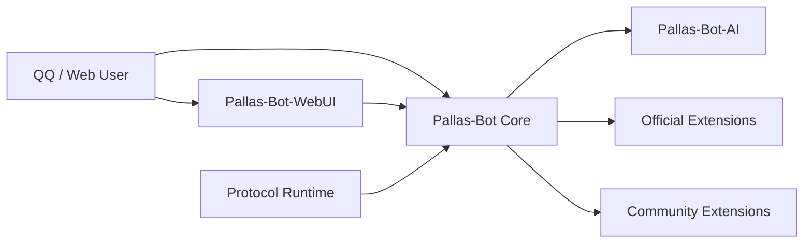

# Pallas-Bot 文档

牛牛文档按用途分四条线：**上手**（跑通）、**使用**（口令与控制台）、**运维**（部署与排障）、**开发**（写插件）。

> 在线阅读：[Pallas-Bot-Docs](https://PallasBot.github.io/Pallas-Bot-Docs/)

## 选一条路

| 你是谁 | 去哪 | 能解决什么 |
| --- | --- | --- |
| 第一次装 | [五分钟跑起来](guide/quickstart.md) | 本机跑通、连 QQ、群里能回话 |
| 要装扩展 / AI | [把玩法 / AI 也装上](guide/4.0-start.md) | 官方插件、AI、记忆 |
| 号主 / VPS 运维 | [运维入口](maintainer/quickstart.md) | Docker、分片、升级、排障、配置 |
| 插件作者 | [Developer](developer/index.md) | 架构、插件开发、发布 |
| 群友查口令 | [口令与功能](guide/usage.md) | 帮助菜单与玩法 |

## 长什么样

一句话各管一摊：

- **Core** — 主运行时、消息入口、插件加载、治理与基础存储。
- **WebUI** — 控制台界面，源码独立仓，构建产物同步回主仓。
- **Protocol Runtime** — QQ 协议接入，单进程和分片都支持。
- **AI Runtime** — 媒体与 AI 任务，通过 callback 回到 Bot。
- **Official / Community Extensions** — 从本体拆出去的玩法与能力。

## 常去的几页

| 页面 | 干什么 |
| --- | --- |
| [五分钟跑起来](guide/quickstart.md) | 唯一「跑通」入口 |
| [运维入口](maintainer/quickstart.md) | 部署 / 升级 / 排障索引（不重复装本体） |
| [安装官方插件](guide/install-extensions.md) | 装 / 卸扩展 |
| [分片部署](maintainer/deploy/sharded.md) | hub / worker / Redis |
| [排障](maintainer/operate/troubleshooting.md) | 排查顺序 |
| [写第一个插件](developer/plugin-development/first-plugin.md) | 开发入门 |
| [Golden Plugin](developer/plugin-development/golden-plugin.md) | 官方推荐插件骨架 |

::: tip 文档入口
在线站由主仓 `docs/` 同步到 [Pallas-Bot-Docs](https://PallasBot.github.io/Pallas-Bot-Docs/)。  
权威路径：上手看 `guide/`，运维看 `maintainer/`，开发看 `developer/`。
:::
