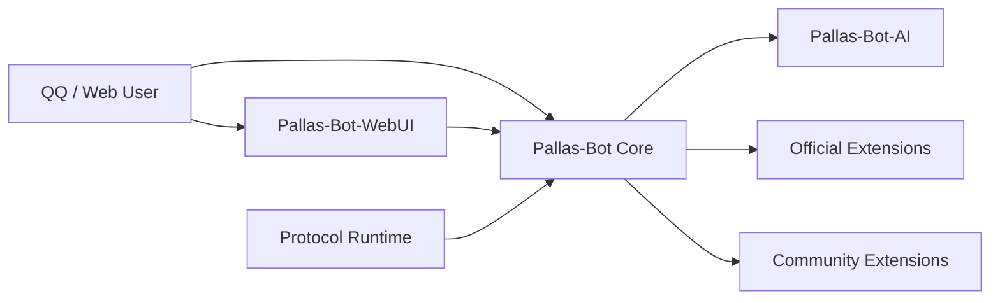

# Pallas-Bot 4.0 文档

牛牛的文档分两条线：**维护者**怎么把它跑起来、管起来；**插件开发者**怎么给它加能力。

> 在线阅读：[Pallas-Bot-Docs](https://PallasBot.github.io/Pallas-Bot-Docs/)

## 选一条路

| 你是谁 | 去哪 | 能解决什么 |
| --- | --- | --- |
| 号主、运维、部署维护者 | [Maintainer](maintainer/quickstart.md) | 安装、部署、协议端、AI、扩展、排障 |
| 本体维护者、扩展 / 插件作者 | [Developer](developer/index.md) | 架构、插件开发、治理、发布、接口 |
| 普通用户 | [用户手册](user/README.md) | 后续单独建设，这轮先不重写 |

## 4.0 长什么样

一句话各管一摊：

- **Core** — 主运行时、消息入口、插件加载、治理与基础存储。
- **WebUI** — 控制台界面，源码独立仓，构建产物同步回主仓。
- **Protocol Runtime** — QQ 协议接入，单进程和分片都支持。
- **AI Runtime** — 媒体与 AI 任务，通过 callback 回到 Bot。
- **Official / Community Extensions** — 4.0 后从本体拆出去的玩法与能力。

## 维护者常去的几页

| 页面 | 干什么 |
| --- | --- |
| [快速开始](maintainer/quickstart.md) | 从零跑起一套 4.0 环境 |
| [安装官方扩展](maintainer/install/official-extensions.md) | 装 / 卸 / 重启扩展，Docker 预装 |
| [分片部署](maintainer/deploy/sharded.md) | hub / worker / Redis / 协议端 / 分片日志 |
| [WebUI](maintainer/install/webui.md) | 前端仓边界、构建产物、线上资源同步 |
| [排障](maintainer/operate/troubleshooting.md) | 配置、角色、日志、聚合状态的排查顺序 |

## 开发者常去的几页

| 页面 | 干什么 |
| --- | --- |
| [架构总览](developer/architecture/overview.md) | Pallas 4.0 的整体边界 |
| [Core 与扩展](developer/architecture/core-vs-extensions.md) | 本体 / 官方扩展 / 社区扩展怎么分 |
| [Golden Plugin](developer/plugin-development/golden-plugin.md) | 官方推荐的插件骨架 |
| [配置与 WebUI](developer/plugin-development/config-and-webui.md) | 配置落盘、插件页、热重载 |
| [发布](developer/plugin-development/publishing.md) | 官方扩展、社区插件、PyPI |

::: tip 关于旧文档
`docs/guide`、`docs/develop`、`docs/architecture`、`docs/common` 现在只作迁移素材，不再是正式入口。普通用户文档会另起一套用户手册，不和开发文档混写。
:::
