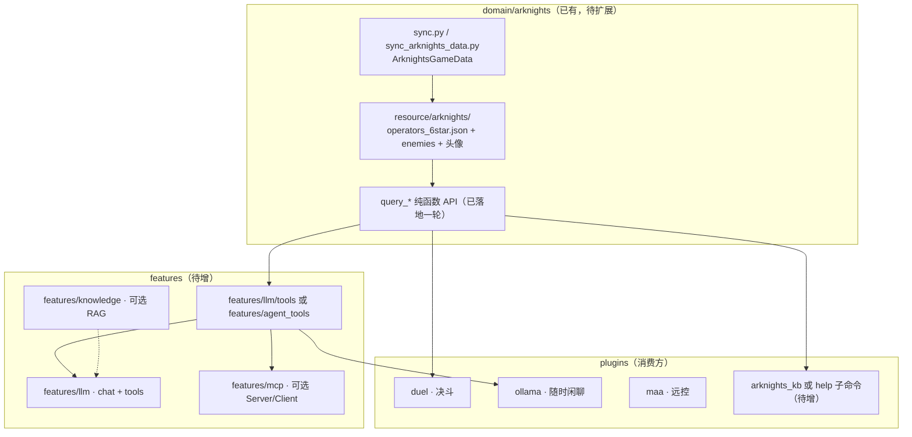
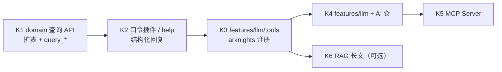

# 明日方舟 · 内置知识库与 MCP 工具

> **现行总纲**：见 [Pallas 核心契约](pallas-core-contract.md)。让用户用自然语言或指令查询干员、关卡、材料等**可验证**的游戏资料；与 [persona-llm-roadmap](persona-llm-roadmap.md) 的 LLM / 工具调用阶段衔接。**不**把游戏数据写进接话语料或群风格统计。`domain/arknights` 留本体；玩法插件（如 `duel`）迁扩展仓后仍通过 domain API 访问。

## 目标

| 做 | 不做 |
| --- | --- |
| 结构化游戏数据查询（干员、技能、关卡等） | 用 LLM 幻觉代替数值/名称 |
| 同一套查询 API 服务：口令插件、闲聊 LLM、MCP | 每个插件各拉一份 GameData |
| 本地 JSON/SQLite + 定时同步，离线可答 | 每条消息实时爬 Wiki |
| 可选 RAG（长文攻略、活动公告摘要） | 首版就上全量 embedding 库 |
| MCP 暴露/消费工具（Phase 3+） | 与 repeater 语料池混用 |

用户感知示例：

- 口令：`/干员 银灰` → 结构化卡片（现有 duel 数据可扩展）
- 闲聊：`@牛牛 伊内丝三技能专几？` → LLM 分类 → 调 `query_operator_skill` → 帕拉斯口吻总结
- MCP：外部 Agent 经 MCP 调 `pallas.arknights.operator.get`

## 与现有代码的关系

| 已有 | 说明 |
| --- | --- |
| `src/domain/arknights/` | 决斗用干员表同步、`skill_text`、`query_operator/query_enemy/query_operator_skill` |
| `resource/arknights/operators_6star.json` | 六星 subset；`scripts/sync_arknights_data.py` |
| `resource/arknights/enemies_handbook.json` | 敌人图鉴；`--enemies` / `--kb` |
| `src/plugins/duel/` | 消费干员 JSON + 头像 |
| `src/features/llm/tools/arknights.py` | 方舟 tool handler，直接复用 `domain/arknights/query.py` |
| `src/plugins/ollama/` | 多轮闲聊；legacy 插件本身不再作为新主路径说明 |
| `src/plugins/maa/` | 作战远控，与「资料查询」互补 |

原则：**游戏数据只经 `domain/arknights` 进出**；插件与 LLM 只调 domain / features 公开 API。

## 本仓已有可对齐的实现

| 待实现能力 | 可对齐的本仓模块 | 说明 |
| --- | --- | --- |
| K1 数据同步 | `src/domain/arknights/sync.py`、`scripts/sync_arknights_data.py` | GameData 拉取与 JSON 落盘（决斗/KB 共用） |
| K1 后台 sync | `src/shared/utils/arknights_duel_resource.py`、`duel` 启动钩子 | 缺资源时 schedule 后台同步 |
| K1 分片 sync 收敛 | `src/plugins/repeater/shard_opt.py` 的 `repeater_maintenance_runs_on_worker` | 全库维护仅 shard 0 |
| K2 口令与帮助 | `src/plugins/help/`、`src/features/cmd_perm/` | 帮助图、权限等级、插件 metadata |
| K2 结构化展示 | `src/plugins/duel/` 干员卡片、`help/renderer.py` | 查询结果渲染可参考 duel QTE 资源解析 |
| K3 tool 声明 | `PluginMetadata.extra["command_permissions"]` | 同级增加 `llm_tools` 字段约定 |
| K4 自然语言入口 | `features/llm` + 闲聊入口插件 | `@牛牛` 经 **AI 仓**统一 API；legacy `ollama` 插件过渡 |
| K4 LLM 运行时 | [persona-llm-roadmap](persona-llm-roadmap.md)、[AI 终态架构](pallas-final-ai-shape.md) | 主仓 tools + AI 仓网关 |
| 配置落盘 | [settings-storage](settings-storage.md)、`duel` / `ollama` 的 WebUI 插件配置 | KB 开关与 sync 策略同路径 |
| 作战相关 | `src/plugins/maa/` | 资料查询与远控互补，数据层仍走 `domain/arknights` |

## 两条能力线：知识库 vs MCP

二者互补，不是二选一。

### 1. 内置知识库（Structured KB）

**定位**：确定性查询，结果可审计、可单测、可缓存。

| 层级 | 职责 |
| --- | --- |
| `domain/arknights/` | 表结构、同步、索引、`query_operator(name)` 等 |
| `resource/arknights/` | 版本化静态快照（JSON）；大资源（头像）仍放 resource |
| `features/knowledge/`（可选） | 对长文档做 chunk + embedding；**仅**用于攻略/公告类非结构化文本 |

数据来源（维护者向）：

- 主源：[ArknightsGameData](https://github.com/Kengxxiao/ArknightsGameData)（与现有 `fetch_arknights_duel_data.py` 同源思路）
- 扩展表：`character_table`、`skill_table`、`stage_table`、`item_table` 等按 PR 增量接入
- 同步：启动时/定时任务检查版本；WebUI 展示「数据版本 / 上次同步」

查询类型建议分期：

| 期 | 数据集 | 示例问题 |
| --- | --- | --- |
| v1 | 干员 + 技能（扩展现有 JSON 或新 `operators.json`） | 名字、稀有度、技能描述、专精材料摘要 |
| v2 | 关卡 / 掉落 / 材料 | 「JT8-3 掉什么」「搓玉要多少」 |
| v3 | 活动 / 卡池 / 公招 tag（视合规与维护成本） | 「当前 up」「高星公招组合」 |

**KB 回答必须带引用**：回复中注明数据版本或字段来源，LLM 只负责组织语言，数值来自 tool 返回值。

### 2. MCP / Function Calling（Tool 层）

**定位**：给 LLM 与外部 Agent 统一的「能调用哪些查询」契约。

调用流程：对用户消息做意图分类（是否游戏资料、是否需要联网）→ 仅注入匹配的 `arknights_*` tools 子集 → LLM `tool_call` → `domain` 查询 → 结果回填 → 生成最终回复。避免每条消息携带全部工具 Schema。

Pallas 内建议分层：

| 模块 | 职责 |
| --- | --- |
| `features/llm/tools/registry.py` | 注册 tool：`name`、`schema`、`handler`、`domains` |
| `features/llm/tools/arknights.py` | 包装 `domain/arknights` 查询为 JSON-serializable 结果 |
| `features/mcp/server.py`（可选） | 将同一 registry 暴露为 MCP Server（stdio/SSE） |
| `features/mcp/client.py`（可选） | 连接外部 MCP 服务（需 allowlist） |

Tool 注册来源（扩展顺序）：

1. **内置**：`arknights.operator.get`、`arknights.operator.search`、`arknights.skill.get`
2. **插件 metadata**：从 `PluginMetadata.extra["llm_tools"]` 声明（对齐 [cmd_perm](../common/cmd_perm/README.md) 的 metadata 约定），由 registry 收集
3. **外部 MCP**：配置 URL，client 代理为本地 tool（需 allowlist）

与 [persona-llm-roadmap](persona-llm-roadmap.md) 的 **P9** 对齐：先 Function Calling，再 MCP 协议封装。

## 用户入口（并存）

| 入口 | 路径 | 说明 |
| --- | --- | --- |
| 传统口令 | 新插件或 `help` 子命令 | 不依赖 LLM；适合精确查询 |
| ollama / 统一 LLM | `@牛牛` + tool call | 经 AI 仓；默认关 tool |
| repeater | **不接** | 接话仍走语料；游戏 FAQ 不走复读池 |
| WebUI | 只读浏览 / 同步触发 | 干员检索、数据版本、手动 sync |

## 配置与开关

写入 `pallas.toml` / WebUI（见 [settings-storage](settings-storage.md)），建议键：

| 键 | 默认 | 说明 |
| --- | --- | --- |
| `arknights_kb_enabled` | `true` | 结构化查询总开关 |
| `arknights_kb_auto_sync` | `true` | 缺数据时后台 sync（同 duel） |
| `llm_tools_enabled` | `true` | LLM 是否可调用游戏 tools |
| `llm_tools_arknights_only` | `true` | 首版仅注入 arknights 域 tools |
| `mcp_server_enabled` | `false` | 是否对外暴露 MCP Server |

分片：数据快照在 `resource/` 或共享 PG；**同步任务**建议仅 shard 0 或单 worker 执行（同 repeater maintenance）。

## 建议 PR 顺序

| 阶段 | 依赖 | 交付 |
| --- | --- | --- |
| K1 | 无 | `domain/arknights` 全量/扩展 JSON 同步 + 单元测试 |
| K2 | K1 | 用户可见：`干员查询` 类命令，不经过 LLM |
| K3 | K1 + [LLM P2–P4](persona-llm-roadmap.md) | tool registry + arknights handlers |
| K4 | K3 | `features/llm` + **Pallas-Bot-AI** tool call |
| K5 | K3 | MCP 暴露同一 registry |
| K6 | embedding 基础设施 | 攻略/公告 RAG，**不**替代结构化查询 |

**推荐路径**：先 **K1 + K2**（零 LLM 依赖、立刻有用），再与 LLM 路线图 **P2–P4 并行 K3**。

## 架构约束

1. **结构化优先**：干员名、数值、掉落表 → 必须走 domain 查询；LLM 禁止凭空编。
2. **与语料/ persona 隔离**：游戏 KB 不进 `Context.answers`、不进 `style_profile`。
3. **与 duel 解耦**：决斗继续用六星 subset；KB 可服务全星级，共享 sync 管道。
4. **默认关 LLM tools**：总闸 `LLM_CHAT_ENABLED` 关时不注入；子项 `LLM_TOOLS_ENABLED` 默认开。
5. **版权与维护**：数据源版本 pinned；文档注明「非官方、随游戏更新需 sync」；不提供私服/破解向数据。
6. **失败回退**：tool 超时 → 提示「数据暂不可用」+ 可选口令帮助；不 hallucinate。

## 验收清单

### K1–K2（无 LLM）

- [ ] 同步脚本可重复运行，版本号写入 resource 或 PG
- [x] `query_operator("银灰")` 类 API 有单测（含常见别名/混写）
- [ ] 口令查询与 duel 不互相破坏；缺 JSON 时行为与 duel 现有 auto-sync 一致

### K3–K4（LLM + tools）

- [x] 分类后仅注入 arknights tools
- [ ] `@牛牛` 问技能数据 → 答案与口令查询一致
- [ ] tool 失败时不编造数值

### K5（MCP）

- [ ] 同一 `query_operator` 经 MCP 与经群内 LLM 结果一致
- [ ] MCP 默认关；开启需 superuser / WebUI

## 相关文档

- [persona-llm-roadmap.md](persona-llm-roadmap.md) — LLM 运行时与 P9 工具调用
- [common-layers.md](common-layers.md) — `domain/` vs `features/` vs `plugins/`
- [pallas-final-ai-shape.md](pallas-final-ai-shape.md) — AI 终态架构
- [plugins/ollama](../plugins/ollama/README.md) — 现状（legacy `/api/ollama/*`）
- [plugins/duel](../plugins/duel/README.md) — 现有干员数据消费
- [plugins/help](../plugins/help/README.md) — 帮助与插件展示
- [cmd_perm](../common/cmd_perm/README.md) — 工具/命令 metadata 与权限
- `scripts/sync_arknights_data.py` — 统一同步入口（`--kb` / `--all` / `--maintainer-lore`）
- [pallas-4.0-roadmap.md](pallas-4.0-roadmap.md) — 4.0 插件分家与 domain 边界
