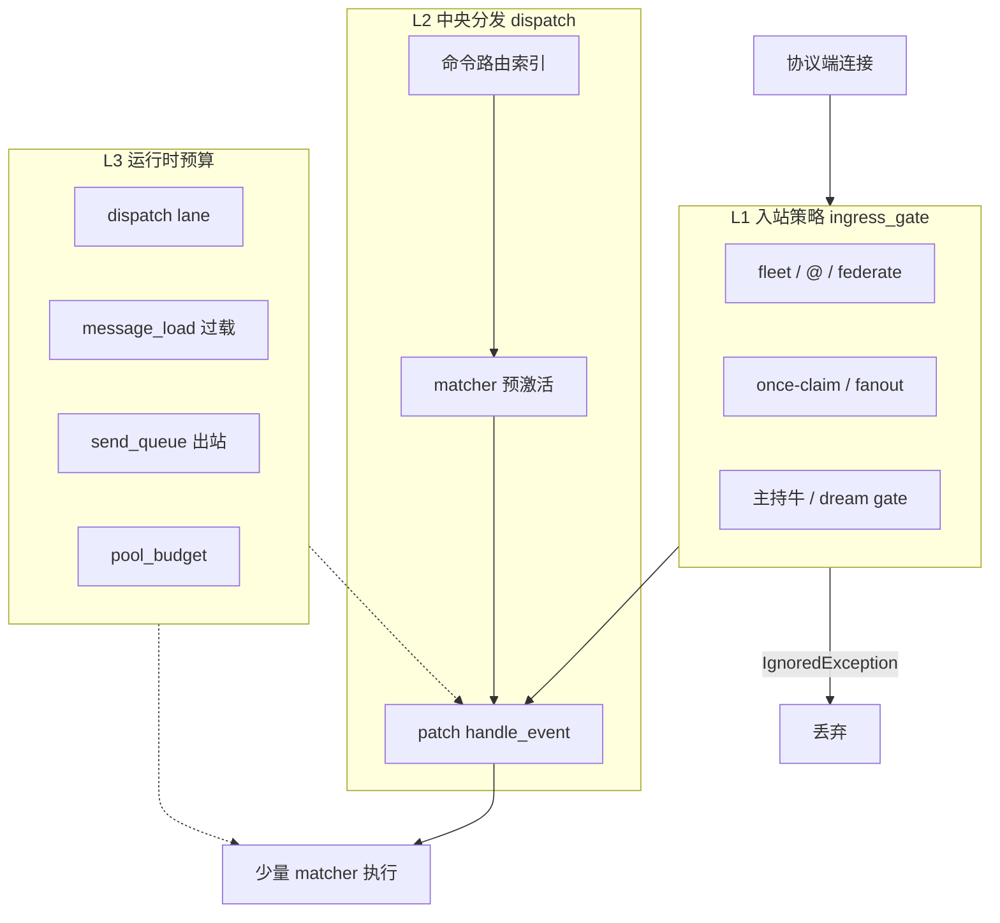
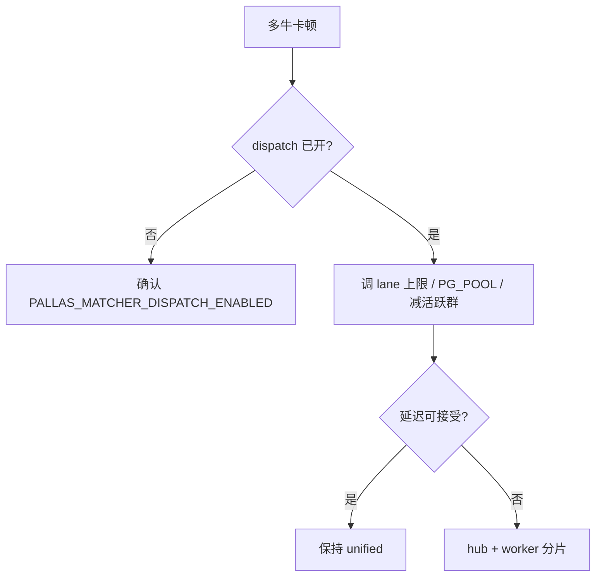

# 中央入站调度

单进程多牛卡顿，常见原因不是缺少 async，而是 **消息放大** 与 **matcher 扇出**：

| 放大源 | 粗估倍数 |
|--------|----------|
| 同群 N 只牛各收一条群消息 | × N |
| 每只牛遍历 M 个 matcher 做 `check_rule` | × M |
| 重插件占满连接池或 event loop | 拖慢全进程 |

**中央入站调度**在 **unified** 与 **worker** 进程内，于 NoneBot 原生 matcher 之上做预筛选、并发预算与出站整形，把单进程可承载的牛数尽量拉高。仍不足时，按 [多进程分片](bot_process_sharding.md) 拆 hub + worker，不再维护额外的轻量多 unified 方案。

## 挂载范围

入站调度与 APScheduler、数据库初始化同级：**凡承接牛牛 OneBot 消息的进程必须挂载**，不依赖某个业务插件是否加载。

| 组件 | 路径 | 挂载 | 职责 |
|------|------|------|------|
| **ingress_dispatch 运行时** | `platform/bot_runtime` | `load_plugins_for_role()`，unified / worker | 安装 `handle_event` patch、lane、send_queue |
| **platform/ingress** | `platform/ingress` | 被运行时调用 | matcher 预激活、路由索引、lane、出站队列 |
| **ingress_gate 插件** | `plugins/ingress_gate` | unified / worker，与 dispatch 并行 | 舰队 claim、fanout、主持牛 gate |

```text
bot.py / bot_worker.py
  └─ load_plugins_for_role()
       ├─ register_ingress_dispatch_runtime()
       ├─ load_ingress_gate_plugin()
       └─ …业务插件
```

- **hub** 不接牛牛 WebSocket → 不注册 dispatch、不加载 `ingress_gate`。
- 插件作者通过 `PluginMetadata.extra` 声明路由与 lane，**不要**自行 patch `handle_event`。
- 分层说明见 [内核分层 · platform](common-layers.md)。

## 分层架构



实现入口：

| 路径 | 说明 |
|------|------|
| `src/platform/bot_runtime/ingress_dispatch_runtime.py` | 启停 hook |
| `src/platform/ingress/matcher_dispatch.py` | patch `handle_event` |
| `src/platform/ingress/matcher_activation.py` | 闲聊跳过纯命令 matcher |
| `src/platform/ingress/route_index.py` | 命令 prefix / exact 倒排 |
| `src/platform/ingress/dispatch_lanes.py` | 四档 lane 限并发 |
| `src/platform/ingress/send_queue.py` | OneBot 出站 API 整形 |
| `src/platform/ingress/message_load.py` | 过载信号 |
| `src/platform/ingress/dispatch_metrics.py` | 进程内指标 |
| `src/platform/ingress/fleet_dispatch_scale.py` | 按在线牛数缩放默认预算 |
| `src/platform/ingress/matcher_rule_prefilter.py` | 确定性规则预筛 |
| `src/platform/ingress/dispatch_stats_logger.py` | 周期 stats 日志 |
| `src/platform/multi_bot/platform_utils.py` | 出站 V11 Bot 选择 |

与 `multi_bot/`、`shard/` 并列，**不**放在 `plugins/`。

## 与 ingress_gate 的边界

| 模块 | 职责 | dispatch 不改 |
|------|------|----------------|
| ingress_dispatch 运行时 | matcher 级扇出、过载、lane | 业务 handler |
| ingress_gate 插件 | 牛级路由、claim、fanout | 插件逻辑 |
| pool_budget | PG 池背压 | SQL 语义 |
| shard/coord | 跨进程 claim、buffer | 分片时才必需 |

## Matcher 预筛选

**matcher_dispatch** 在 startup 时 patch `nonebot.message.handle_event`，并对 OneBot V11/V12 adapter 的 `handle_event` 做同样包装（避免协议层绕过中央分发）：

- 群消息进入后先走 **matcher_activation**：闲聊流量跳过仅含 `CommandRule` 的 matcher。
- **matcher_rule_prefilter** 在 `check_rule` 前按 Command/Startswith/Keywords 等确定性规则做 fail-open 预筛，进一步缩小候选集。
- 选中 matcher 经 **dispatch_lanes**  acquire 后再执行 handler。
- 选中 matcher 过多时 **message_load** 发出过载信号，后台任务让路。

| 键 | 默认 |
|----|------|
| `PALLAS_MATCHER_DISPATCH_ENABLED` | 开 |
| `PALLAS_MATCHER_DISPATCH_OVERLOAD_THRESHOLD` | `24`；未显式配置时按在线牛数缩放（`fleet_dispatch_scale`） |

过载窗口内 **corpus prefetch** 会暂停，避免与热路径抢资源。

## 命令路由索引

**route_index** 在启动时优先读取 `PluginMetadata.extra` 中显式声明的：

- `command_prefixes`
- `exact_plaintexts`

若插件未显式声明，再回退读取 `menu_data`、`ingress_fanout` 与既有口令明文表：

- `prefix → plugin_module` 倒排
- `exact_plaintext → plugin_module`

**select_priority_matchers** 据此缩小候选集：

- 闲聊：跳过 command-only 与 prefix 不匹配的已索引插件 matcher
- 命令：保留索引命中模块、全局 passive、以及 `block=True` 高优先级 matcher

| 键 | 默认 |
|----|------|
| `PALLAS_ROUTE_INDEX_ENABLED` | 开 |
| `PALLAS_ROUTE_INDEX_STRICT` | 关，未命中索引时回退全量 matcher |

索引漏网时默认 **safe mode** 回退全量 matcher，避免口令无反应。生产稳定后可按需开启 strict。

## Dispatch Lane

**dispatch_lanes** 为 matcher 分配四档并发预算：

| 档位 | 典型 matcher |
|------|----------------|
| **command** | `on_command`、带 CommandRule |
| **chat** | 群聊被动、轻量 regex |
| **storage** | PG 密集，与 **pool_budget** 联动，高压时自动收紧 |
| **remote** | HTTP、AI、渲染等外呼 |

进入 handler 前 acquire；超时后直接静默丢弃，不再发送忙回复。lane 等待超过阈值时 **message_load** 触发过载。

插件可在 `extra["ingress_route"].lane` 声明档位；旧名如 `passive_ai` 会自动映射到 `remote`。

| 键 | 默认 |
|----|------|
| `PALLAS_DISPATCH_LANES_ENABLED` | 开 |
| `PALLAS_LANE_ACQUIRE_TIMEOUT_SEC` | `1.0` |
| `PALLAS_LANE_WAIT_OVERLOAD_MS` | `250` |
| `PALLAS_LANE_COMMAND` | `16`；未配置时按在线牛数缩放，上限 `64` |
| `PALLAS_LANE_CHAT` | `32`；未配置时按在线牛数缩放，上限 `48` |
| `PALLAS_LANE_STORAGE` | `min(8, PG_POOL_SIZE)` |
| `PALLAS_LANE_REMOTE` | `4`；未配置时按在线牛数缩放，上限 `16` |

## 出站整形

**send_queue** patch `OneBotV11Adapter._call_api`，将 `send_*msg` 类 API 入队，由 worker 池按最小间隔发送。队列高压时丢弃点赞类 API，群消息优先。

| 键 | 默认 |
|----|------|
| `PALLAS_SEND_QUEUE_ENABLED` | 开 |
| `PALLAS_SEND_QUEUE_WORKERS` | `2` |
| `PALLAS_SEND_QUEUE_MAX_DEPTH` | `256` |
| `PALLAS_SEND_QUEUE_MIN_INTERVAL_MS` | `50` |
| `PALLAS_SEND_QUEUE_ENQUEUE_TIMEOUT_SEC` | `2.0` |

渲染与 Playwright 仍走现有 **media_cache** 队列，与 message_load 联动。Pallas-Bot-AI 保持外置服务，ingress 层 remote lane 负责限流。

## 可观测

### WebUI API

`GET /pallas/api/ingress-dispatch` 返回进程内快照：

| 字段 | 含义 |
|------|------|
| `group_messages` | 群消息计数 |
| `matchers_considered` / `matchers_selected` / `matchers_run` | matcher 漏斗 |
| `route_index_hits` / `route_index_fallbacks` | route_index 命中 / 回退计数 |
| `route_index_hit_ratio` / `route_index_fallback_ratio` | route_index 命中率 / 回退率 |
| `ingress_duration_ms_p95` | 入站处理 P95 |
| `lane_wait_ms_avg` / `lane_busy` | lane 等待 |
| `overload_signals` / `prefetch_paused` | 过载与 prefetch 跳过 |
| `send_queue` | 出站队列 depth / dropped / sent |
| `pool_budget` | PG 池利用率 |
| `alerts` | 告警标签数组 |

告警阈值：`ingress_p95_over_100ms`、`pg_pool_over_85pct`。

### 命令行

```bash
./scripts/run_unified_bot.sh observability
# 或
uv run python scripts/ingress_dispatch_status.py
```

unified 进程须已运行；脚本读取当前进程内存指标，非分片聚合。

周期日志：进程内每 `PALLAS_DISPATCH_STATS_LOG_INTERVAL_SEC`（默认 `60`）打一条 `ingress_dispatch: stats`，便于对照 matcher 漏斗、route_index 命中/回退与 lane 占用。

## 出站 Bot 选择（platform_utils）

主动出站未指定 `bot` 时，**platform/multi_bot/platform_utils** 仅支持 OneBot V11：

- 恰好一只 V11 在线 → 自动选用
- 多只 V11 或多协议并存 → **不猜测**，打 warning 并跳过（对齐真寻 fail-safe）
- 候选牛号已知时可用 `pick_connected_bot_id`；唯一在线则确定，多个在线由调用方决定策略

入站舰队路由仍由 **ingress_gate** 负责，不用 `bot_filter` 替代。

分片下的跨 worker 指标见 [多进程分片 · WebUI 与日志](bot_process_sharding.md#webui-与日志hub) 中的 `shard-observability`。分片 hub 上 `GET /pallas/api/ingress-dispatch` 汇总各 worker 落盘的 dispatch 快照。

## 扩容路径



| 部署 | 进程 | 适用 |
|------|------|------|
| **unified** | 单进程 + dispatch | 日常与中等规模牛数 |
| **hub + worker** | 1 + N，共享 `data/` | 大规模牛数、需跨片 coord |

单进程侧先把 dispatch 调满；仍不达标再上分片，避免多套运维入口并存。

## 插件约定

- 高流量或高价值命令优先在 `extra` 显式声明 `command_prefixes` / `exact_plaintexts`；`menu_data` 更适合作为帮助与文档面，不建议继续充当唯一的路由来源。
- 用户可见口令仍应写入 `menu_data` 或 `ingress_fanout`，便于帮助展示与 route_index 补全收录。
- 重命令在 `extra` 标注 `ingress_route.lane`，缺省按 matcher 规则推断。
- fanout、主持牛、独占活动等行为仍由 **ingress_gate** 与各插件 metadata 决定，见 [多进程分片 · ingress_fanout](bot_process_sharding.md)。

示例：

```python
extra={
    "ingress_route": {"lane": "remote"},
    "ingress_fanout": {...},
}
```

## 回滚

各块独立 env 开关。建议关闭顺序：lane → route_index strict → `PALLAS_MATCHER_DISPATCH_ENABLED=false`，恢复 NoneBot 原生 `handle_event`。不涉及 `data/` 与协议端配置变更。

## 相关文档

- [多进程分片](bot_process_sharding.md)
- [内核分层](common-layers.md)
- [标准部署](../Deployment.md)
