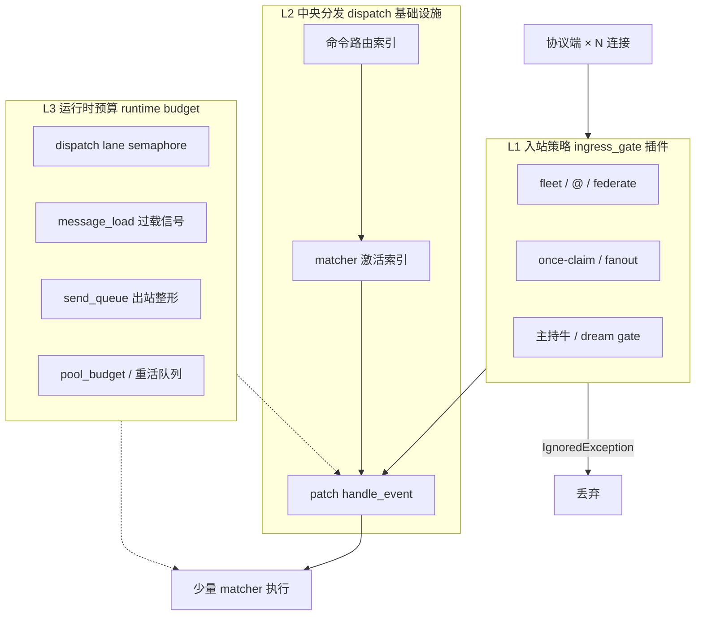
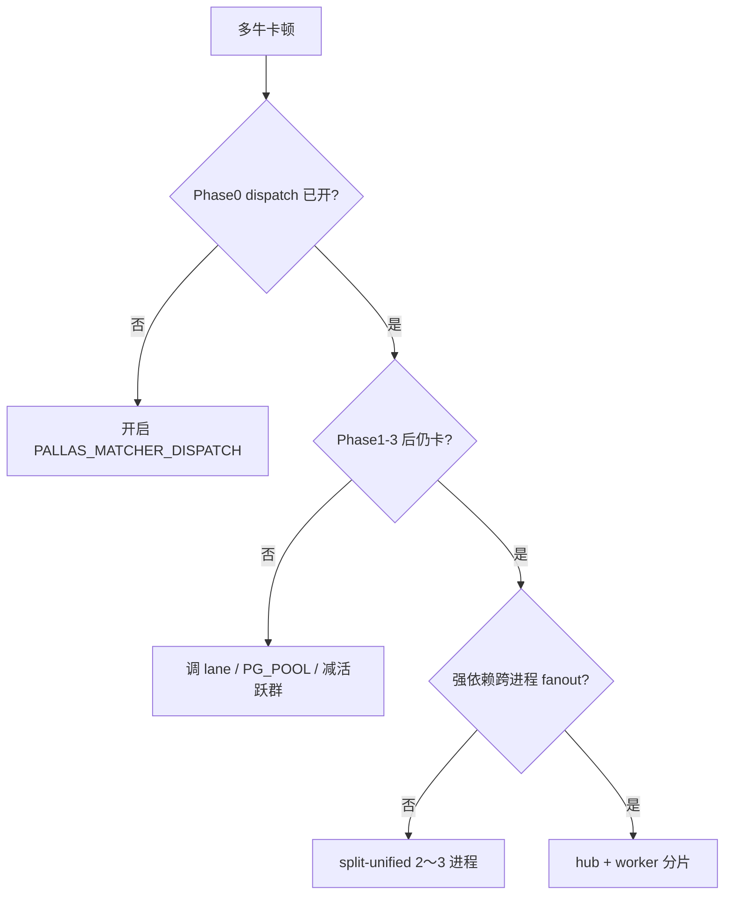

# 中央入站调度（基础设施）

单进程多牛过载的主因不是「没写 async」，而是 **消息放大** 与 **matcher 扇出**：

| 放大源 | 量级（粗估） |
|--------|----------------|
| 同群 N 只牛各收一条群消息 | × N |
| 每只牛遍历 M 个 matcher 做 `check_rule` | × M |
| 重插件（DB / AI / 渲染）无并发预算 | 拖死 event loop |

**hub + worker 分片** 解决「单进程装不下」。本文描述在 **unified / worker** 进程内把调度做满的基础设施路线，使多数部署不必上完整分片。

## 基础设施定位

入站调度与 APScheduler、DB 初始化同级：**凡承接牛牛 OneBot 消息的进程必须挂载**，不依赖某个业务插件是否加载。

| 组件 | 层级 | 挂载 | 职责 |
|------|------|------|------|
| **`ingress_dispatch` 运行时** | `platform/bot_runtime` | `load_plugins_for_role()`（unified / worker） | patch `handle_event`、过载信号、后续 lane / send_queue |
| **`platform/ingress/*` 实现** | `platform/ingress` | 被运行时调用 | matcher 预激活、路由索引（Phase 1+） |
| **`ingress_gate` 插件** | `plugins/ingress_gate` | 同上，与 dispatch 并行 | 舰队 claim、fanout、主持牛 gate（**业务入站策略**） |

```text
bot.py / bot_worker.py
  └─ load_plugins_for_role()
       ├─ register_ingress_dispatch_runtime()   # 基础设施
       ├─ load_ingress_gate_plugin()            # 舰队 preprocessors
       └─ …业务插件
```

- **hub** 不接牛牛 WS → **不**注册 dispatch、**不**加载 `ingress_gate`。
- 插件作者：重命令将来可声明 `extra["ingress_route"]`；**不应**自行 patch `handle_event`。
- 详见 [内核分层 · platform](common-layers.md)。

## 目标

- 10～30+ 牛 unified 下，群聊尖峰 **event loop 延迟可接受**（P95 ingress→首条回复可观测）。
- **舰队语义不变**：once-claim、fanout 白名单、主持牛 gate、跨片 coord（若启用分片）。
- 插件仍用 **原生 NoneBot matcher**，不要求迁框架。
- 改造 **可分期上线**，每期可单独开关、可回滚。

## 非目标

- 不替换 NoneBot / 不重写插件为 Alconna 或 Amiya 装饰器。
- 不以此文档一次性废除分片；分片仍是 **最终扩容** 手段。
- 不在第一期做 gsuid 式「独立 Core 进程 + 全插件 RPC」。

## 分层架构



参考对照：

| 能力 | 真寻 / Amiya | Pallas 落点 |
|------|--------------|-------------|
| 早退 / 舰队过滤 | auth hook、bot_filter | `ingress_gate` 插件 |
| 只跑少量 handler | ActivationIndex、priority | `platform/ingress` + `bot_runtime/ingress_dispatch_runtime` |
| 分 lane 限并发 | storage / remote | `platform/ingress/dispatch_lanes` |
| 出站排队 | send_queue | `platform/ingress/send_queue`（待做） |
| 多进程 | 无内置分片 | `bot_process_sharding`（备选） |

实现目录：

- **`src/platform/bot_runtime/ingress_dispatch_runtime.py`** — 注册启停 hook（基础设施入口）
- **`src/platform/ingress/`** — dispatch 实现（`matcher_dispatch`、`message_load`、Phase 1+ 的 `route_index` / `dispatch_lanes` / `send_queue`）

与 `multi_bot/`、`shard/` 并列，**不**放在 `plugins/`。

---

## 分期路线

### Phase 0 — 已完成（baseline）

| 项 | 路径 | 行为 |
|----|------|------|
| 运行时注册 | `bot_runtime/ingress_dispatch_runtime.py` | unified / worker 在 `load_plugins_for_role` 挂载 |
| 过载信号 | `ingress/message_load.py` | `signal_overload` / `should_pause_tasks` |
| 闲聊跳过纯命令 matcher | `ingress/matcher_activation.py` | `command_traffic=False` 时不跑 CommandRule-only |
| patch `handle_event` | `ingress/matcher_dispatch.py` | 由运行时 `on_startup` 安装 |
| 后台让路 | `features/corpus/prefetch.py` | 过载窗口内跳过 prefetch |

配置：

| 键 | 默认 |
|----|------|
| `PALLAS_MATCHER_DISPATCH_ENABLED` | 开 |
| `PALLAS_MATCHER_DISPATCH_OVERLOAD_THRESHOLD` | `24` |

**验收**：单测 `tests/platform/ingress/test_matcher_dispatch.py`；生产看启动日志 `matcher_dispatch: installed`。

---

### Phase 1 — 命令路由索引（2～3 周）✅ 已实现

**问题**：Phase 0 仍会对闲聊跑全部 `on_message` / regex matcher；命令流量仍扫描无关插件。

**做法**：

1. **`route_index.py`**：启动时从 `PluginMetadata.extra`（`menu_data`、`ingress_fanout`、已有 `plugin_command_plaintext`）构建：
   - `prefix → plugin_module` 倒排
   - `exact_plaintext → plugin_module`
2. **`event_command_traffic` 增强**：命中索引才标记 command；否则 chatter。
3. **`select_priority_matchers` 增强**：
   - chatter：跳过 **command-only** + **已索引且 prefix 不匹配** 的插件 matcher（按 `matcher.plugin_name` / `module_name`）
   - command：仅保留索引命中的模块 + 全局 passive（复读、ingress 旁路）+ `block=True` 高优先级
4. 插件可选声明 `extra["ingress_route"]`：`lanes`、`passive`、`always_run`（与 cmd_perm 元数据并列，文档化即可）。

配置：

| 键 | 默认 |
|----|------|
| `PALLAS_ROUTE_INDEX_ENABLED` | 开 |
| `PALLAS_ROUTE_INDEX_STRICT` | 关（未命中索引时回退全量 matcher） |

**验收**：

- 压测：30 牛 unified，纯闲聊群，matcher `check_rule` 调用次数下降 **≥50%**（指标见 Phase 5）。
- 回归：帮助、喝酒 fanout、卧底主持牛、复读接话用例全绿。

**风险**：索引漏网导致「口令无反应」→ 未命中索引时 **回退全量 matcher**（safe mode 开关 `PALLAS_ROUTE_INDEX_STRICT=false` 默认）。

---

### Phase 2 — Dispatch Lane 与全局预算（2～3 周）✅ 已实现

**问题**：少数重命令（AI、画图、PG 密集）占满连接池与 loop。

**做法**（借鉴真寻 `auth_checker` lane）：

1. **`dispatch_lanes.py`**：matcher 分四档并发预算：
   - **`command`**：口令（`on_command` / 带 CommandRule）
   - **`chat`**：群聊被动 matcher（轻量接话、regex 玩法）
   - **`storage`**：PG 密集（与 **`pool_budget`** 联动，高压时自动收紧）
   - **`remote`**：外呼重活（HTTP / AI / 渲染）
2. 每档 **asyncio 条件变量** 限并发，上限来自 env / WebUI。
3. **`check_and_run_matcher` 外包一层**：进入 handler 前 acquire；超时则丢弃，命令流量可发人设忙回复。
4. **`message_load`**：lane 等待超过阈值时 `signal_overload`，扩展暂停面至：语料 prefetch、image capture、定时主动发言（非 fanout）。

插件 `extra["ingress_route"].lane` 填上述四档之一；旧名（如 `passive_ai`）会自动映射。

配置：

| 键 | 默认 |
|----|------|
| `PALLAS_DISPATCH_LANES_ENABLED` | 开 |
| `PALLAS_LANE_ACQUIRE_TIMEOUT_SEC` | `1.0` |
| `PALLAS_LANE_WAIT_OVERLOAD_MS` | `250` |
| `PALLAS_LANE_BUSY_REPLY` | 开 |
| `PALLAS_LANE_COMMAND` | `16` |
| `PALLAS_LANE_CHAT` | `32` |
| `PALLAS_LANE_STORAGE` | `min(8, PG_POOL_SIZE)` |
| `PALLAS_LANE_REMOTE` | `4` |

默认档位上限：

| 档位 | 建议默认 |
|------|----------|
| `storage` | `min(8, PG_POOL_SIZE)` |
| `remote` | `4` |
| `command` | `16` |
| `chat` | `32` |

**验收**：人工触发 5 条并发 AI 命令，PG `checked_out` 不超过池容量 80%；loop 不被无限排队拖死。

---

### Phase 3 — 出站整形与重活外置（2 周）

**问题**：fanout / 多牛同响时 **发送** 与 **渲染** 放大。

**做法**：

1. **`send_queue.py`**：patch `OneBotV11Adapter._call_api`（参考真寻），`send_msg` 类 API 入队；worker 池 + 最小间隔；队列满时降级（点赞可丢、群消息优先）。
2. **渲染 / Playwright**：统一经现有 `media_cache` / 插件队列，matcher 只 `create_task` 入队。
3. **Pallas-Bot-AI**：保持外置；ingress 层对 AI lane 单独限流即可。

**验收**：fanout 口令（如报数）N=15 牛，协议端无 burst 断连；发送队列深度可观测。

---

### Phase 4 — 观测与压测基线（与 Phase 1～3 并行）

1. **指标**（WebUI「入站调度」或扩展现有分片可观测）：
   - 每群消息：`ingress_outcome`、`matchers_considered`、`matchers_run`、`lane_wait_ms`
   - 过载：`overload_signals_total`、`prefetch_paused_total`
2. **脚本**：扩展 `run_unified_bot.sh` 对照文档，固定 `data/` 30 牛 synthetic 群消息 replay。
3. **告警阈值**：P95 ingress 路径 > 100ms 或 PG 池 > 85% 持续 5min。

---

### Phase 5 — 轻量多进程（可选，替代「完整分片」）

若 Phase 1～3 后 unified 仍不足，提供 **比重片轻** 的运维选项：

| 模式 | 进程 | Redis | 适用 |
|------|------|-------|------|
| unified + dispatch | 1 | 否 | ≤15 牛或轻群 |
| **split-unified** | 2～3 个 unified，手动分 QQ 子集 | 否 | 无强 cross-worker fanout |
| hub + worker | 1+N | 是 | 完整舰队 + 20+ 牛 |

**split-unified**：共用 PG / `data/`，各进程独立 WebUI 或只开一个；**不**写 `registry.json`；跨进程 fanout 不保证。文档与脚本 `run_split_unified.sh`（待做）即可，不扩 coord 面。

完整分片见 [多进程分片](bot_process_sharding.md)。

---

## 决策树（部署选型）



---

## 与现有模块的边界

| 模块 | 职责 | dispatch 不改 |
|------|------|----------------|
| `ingress_dispatch` 运行时 | matcher 级扇出、过载、lane（基础设施） | 业务 handler |
| `ingress_gate` 插件 | 牛级路由、claim、fanout | 插件逻辑 |
| `pool_budget` | PG 池背压 | SQL 语义 |
| `shard/coord` | 跨进程 claim / buffer | 分片时才必需 |

新插件约定（Phase 1 起）：

- 用户可见口令写入 `menu_data` / `ingress_fanout`，便于索引。
- 重命令在 `extra` 标注 `ingress_route.lane`（可选，缺省按 matcher 规则推断）。

---

## 回滚策略

每期独立 env 开关；关闭顺序：lane → route_index strict → `PALLAS_MATCHER_DISPATCH_ENABLED=false`（恢复 NoneBot 原生 `handle_event`）。不改变 `data/` 与协议端配置。

---

## 里程碑摘要

| 阶段 | 交付 | 预期效果 |
|------|------|----------|
| **0** | matcher_dispatch + message_load | 闲聊少跑纯命令 matcher |
| **1** | route_index + 严格预筛 | matcher 检查量大幅下降 |
| **2** | dispatch_lanes + pool 联动 | 重命令不拖死 loop / PG |
| **3** | send_queue + 渲染队列 | fanout 发送稳定 |
| **4** | 指标 + 压测 | 可量化、可告警 |
| **5** | split-unified（可选） | 无 Redis 的粗分进程 |

**原则**：先在 **单进程把调度做满**；分片从「默认必选项」降为 **20+ 牛或 Phase 1～3 仍不达标** 时的扩容手段。
