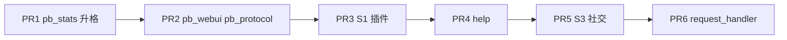

# 内核插件统一化设计（GsUID 式 · 含 pb_stats）

> **状态**：已完成 · **pb_stats 升格** 至 **request_handler** 均已按 golden 模板交付  
> **决策**：范围 **C**（`CORE_PLUGIN_NAMES` 全部 + `community_stats` → **`pb_stats`**）  
> **参考**：[core-devx-roadmap](core-devx-roadmap.md)、[golden plugin checklist](../skills/pallas-plugin-development/references/08-golden-plugin-checklist.md)

## 背景

Core DevX 路线已落地 `plugin_sdk`、`pb_core`、热重载分级、`pb_webui` / `pb_protocol` 改名，以及 **`CORE_PLUGIN_NAMES` 全部 core 插件的 golden 结构统一**（`pb_stats` 升格、`request_handler` 拆分等，见交付记录）。

`community_stats` 已升格为 **`pb_stats`** 并纳入 core；WebUI 段 ID 仍保留 `community_stats` 以兼容已保存配置。

## 目标

| 维度 | 目标 |
| --- | --- |
| 视觉统一 | 阅读任意 core 插件目录，结构一致（metadata 在上、注册在下、业务在外部模块） |
| 命名统一 | 维护者向内核插件包名 **`pb_*`**；`community_stats` → **`pb_stats`** |
| 行为不变 | 分 PR 交付，每 PR 可独立 review/回滚；用户口令与 WebUI 路径不变（除文档用语） |
| 可验收 | 每插件对照 golden checklist；`__init__.py` 行数目标 ≤120（HTTP 型可另设 `startup.py`） |

## 非目标

- 不改 NoneBot matcher 语义、ingress 路由规则的业务结果
- 不在本计划内做 legacy 扩展包（duel、draw 等）统一
- 不实现代码级热重载（仍重启改 Python）

## Golden 模板（core 插件标准形态）

```text
src/plugins/<name>/
├── __init__.py      # PluginMetadata + matcher/路由注册（薄）
├── config.py        # Pydantic + install_hot_reload_config（有 WebUI 项时）
├── handlers.py      # 口令 handler（优先 plugin_sdk）
├── startup.py       # 可选：@driver.on_startup / HTTP 挂载后逻辑
├── service.py       # 可选：长生命周期服务
└── ...              # 领域模块（repositories、renderers 等）
```

**`__init__.py` 约定**

1. 顶部：标准 import（`PLUGIN_EXTRA_VERSION`、`PLUGIN_MENU_TEMPLATE`、`command_perm_list` 等）
2. 中部：`__plugin_meta__` 完整 extra（permissions、limits、menu_data、按需 plugin_storage / reload_policy）
3. 底部：matcher 注册；口令型用 `plugin_sdk.message_command` + `bind_alias_handlers`（复杂被动消息可暂保留 `on_message` + 统一 rule）
4. **禁止**：版本检查、数据库迁移、HTTP 大段逻辑堆在 `__init__.py`

**维护者向 HTTP 插件**（`pb_webui`、`pb_protocol`）

- 路由注册可留在 `__init__.py` 末尾 10～20 行，或 `startup.py` 的 `register_routes(app)`
- `help_audience: maintainer`（插件级或 menu_data 项）

## pb_stats 升格（community_stats → pb_stats）

### 现状

| 项 | 位置 |
| --- | --- |
| 插件壳 | `src/plugins/pb_stats/` |
| 业务 | `src/features/community_stats/` |
| WebUI 段 | `community_stats_section`（段 ID 可保留 `community_stats` 或改为 `pb_stats`） |
| 矩阵 | `EXTRA_PLUGIN_PACKAGES` / pip `pallas-plugin-community-stats` |
| 加载角色 | hub only（`PIP_MODULE_LOAD_ROLE`） |

### 交付

| 步骤 | 内容 |
| --- | --- |
| 目录 | `src/plugins/pb_stats/`，`tests/plugins/pb_stats/` |
| 矩阵 | 加入 `CORE_PLUGIN_NAMES`；从 `EXTRA_PLUGIN_PACKAGES` 移除 |
| 别名 | `plugin_aliases`：`community_stats` / `pallas_plugin_community_stats` → `pb_stats`（≥1 版本周期） |
| 隐藏名单 | `BUILTIN_HELP_HIDDEN_PLUGINS` 等：`community_stats` → `pb_stats`（旧名保留映射） |
| 配置 | `config.py` + `install_hot_reload_config`（复用 `features/community_stats/config`） |
| metadata | `help_audience: maintainer`；`menu_data` 一条说明 WebUI 通用配置段 |
| pip | 扩展仓 README 指向主仓内置；`uv extra` 标记 deprecated 一周期 |

**段 ID / env 键**：WebUI 通用配置段 ID **`community_stats` 暂保留**（避免站长已保存配置失效）；文档称「在线统计（pb_stats）」。

## CORE 插件清单与改造分级

当前 `CORE_PLUGIN_NAMES`（改后含 `pb_stats`，不含 `community_stats`）：

| 插件 | `__init__.py` 行数（约） | 分级 | 主要工作 |
| --- | ---: | --- | --- |
| `pb_core` | 116 | **S0 参照** | 微调即可 |
| `llm_chat` | 60 | **S1 轻** | 补 command_limits / SDK 对齐 |
| `pb_stats` | 46→新 | **S1 升格** | 改名 + golden 壳 |
| `repeater` | 88 | **S1 轻** | handlers 已拆；metadata 与 SDK 对齐 |
| `pb_protocol` | 93 | **S2 中** | startup 抽离 |
| `pb_webui` | 277 | **S2 中** | startup + 版本检查 → `startup.py` / `manager` |
| `drink` | 182 | **S2 中** | handlers 拆分 + SDK |
| `take_name` | 195 | **S2 中** | 同上 |
| `help` | 273 | **S3 重** | matcher 迁 SDK；handlers 已有 |
| `blacklist` | 744 | **S3 重** | 大文件拆 handlers/commands |
| `greeting` | 556 | **S3 重** | 同上 |
| `roulette` | 633 | **S3 重** | 同上 |
| `request_handler` | 1444 | **S4 特大** | 按子域拆模块（好友/入群/风控），**单独 PR** |

分级说明：**行为不变**前提下优先「搬代码 + 统一 metadata 写法」，不顺手改业务逻辑。

## 实施顺序（PR 建议）



| PR | 范围 | 验收 |
| --- | --- | --- |
| **1** | `pb_stats` 升格 + 别名 + 文档 | CI；hub 启动 reporter；WebUI 段仍可用 |
| **2** | `pb_webui`、`pb_protocol` 结构统一 | HTTP 路由正常；窄屏 WebUI 无回归 |
| **3** | `repeater`、`llm_chat`、`drink`、`take_name` | golden checklist；现有测试绿 |
| **4** | `help` | 帮助图/群开关行为不变 |
| **5** | `blacklist`、`greeting`、`roulette` | 同上 |
| **6** | `request_handler` | 分步提交或子 PR；好友/入群申请回归 |

每 PR 更新 `docs/plugins/<name>/README.md` 与 [plugins 索引](../plugins/README.md)。

## 兼容与回滚

- 插件包名别名与 `plugin_matrix` 同步（与 M5 pb_webui 相同模式）
- 全局禁用 / help 隐藏名单双读旧名一周期
- pip extra `plugins-community-stats`、`plugins-llm-chat`：**已移除**；文档标 deprecated，请用 core 内置

## 文档与 Skill 同步

- [core-devx-roadmap.md](core-devx-roadmap.md) 增加「内核插件统一」里程碑
- [plugin-convention.md](plugin-convention.md) 增加 core 插件 **必须** 遵循 golden 模板
- Skill [08-golden-plugin-checklist](../skills/pallas-plugin-development/references/08-golden-plugin-checklist.md) 增加「core 插件」专节
- 新增 `docs/plugins/pb_stats/README.md`；`community_stats` README redirect

## 风险

| 风险 | 缓解 |
| --- | --- |
| `request_handler` 超大 diff | 独立 PR、仅搬代码不改逻辑 |
| 分片 hub/worker 漏改 `pb_stats` 角色 | 沿用 `is_sharded_worker` 守卫；矩阵单测 |
| 站长仍装 pip community-stats | 别名 + loader 去重；文档 deprecated |

## 验收总览

- [x] `CORE_PLUGIN_NAMES` 含 `pb_stats`，不含 `community_stats`
- [x] 全部 core 插件 `__init__.py` 薄化（`blacklist` 131、`request_handler` 160 因 menu 条目略超 120，业务已外迁）
- [x] 全部有口令的 core 插件：`command_permissions` + 按需 `command_limits` + `menu_data` 齐全
- [x] `uv run ruff check src/` 通过；各插件现有测试通过
- [x] 文档与 WebUI 索引反映 pb_stats
