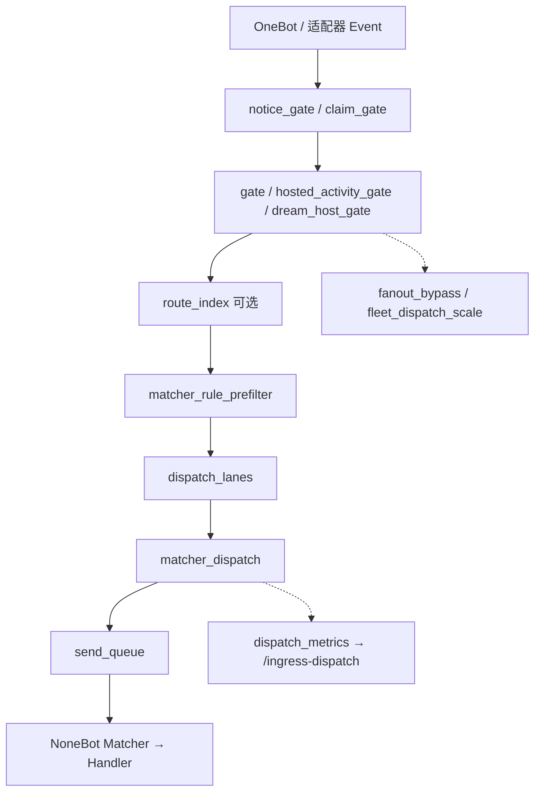

# Ingress 消息入站管线

> 维护者一页图：群/私聊事件从适配器到 NoneBot Matcher 的主路径。  
> 对标 OPT-ARCH-012；代码根目录：`pallas/core/platform/ingress/`。

## 阶段总览

| 阶段 | 模块 | 作用 |
|------|------|------|
| 通知过滤 | `notice_gate.py` | 戳一戳、表情类 notice 丢弃；撤回 once-claim |
| 认领 | `claim_gate.py` | 分片/多牛下消息归属判定 |
| 主 gate | `gate.py` | 全局入站开关、静默丢弃策略 |
| 主持/活动 | `hosted_activity_gate.py` | 群主持牛、活动 spec 过滤 |
| 路由索引 | `route_index.py` | 按命令/前缀缩小 matcher 候选（`PALLAS_ROUTE_INDEX_ENABLED`） |
| 规则预筛 | `matcher_rule_prefilter.py` | Command/Regex/Keywords 等规则快速 miss；**失败时放行** |
| 车道 | `dispatch_lanes.py` | 群消息车道排队，过载时 lane busy / prefetch pause |
| 调度 | `matcher_dispatch.py` | 替换 NoneBot `handle_event`：选 matcher、记录 metrics |
| 发送队列 | `send_queue.py` | 出站消息节流与深度监控 |
| Fanout | `fanout_bypass.py` | 多牛 fanout 明文旁路 claim |

## 与分片的关系

- **Hub**：聚合 worker `ingress_dispatch` / `ingress_metrics`（见 `shard/dispatch_observability.py`、`shard/observability.py`）。
- **Worker**：本进程 `dispatch_metrics_snapshot()` 写入 stats 文件供 hub 拉取。
- **控制台**：`GET /pallas/api/shard-observability`、`GET /pallas/api/ingress-dispatch`。

单进程（未分片）时两接口仍可用，`sharded: false`，仅本进程快照。

## 关键环境变量

| 变量 | 默认 | 说明 |
|------|------|------|
| `PALLAS_MATCHER_DISPATCH_ENABLED` | `true` | 关闭则回退 NoneBot 原生 dispatch |
| `PALLAS_ROUTE_INDEX_ENABLED` | 视配置 | 路由索引预过滤 |
| `PALLAS_MATCHER_DISPATCH_OVERLOAD_THRESHOLD` | 按舰队缩放 | 单消息选中 matcher 过多时记 overload |

## 调试入口

1. 控制台 **分片可观测** / **入站调度** 页（或 API 上表两路径）。
2. 单测：`tests/platform/ingress/`（gate、lanes、prefilter、dispatch）。
3. 日志关键字：`ingress`、`matcher_dispatch`、`lane_busy`。

## 相关文档

- [分片运行时](../developer/architecture/shard-runtime.md)
- [多进程分片](bot_process_sharding.md)
- [前辈对标路线图](internal/benchmark-peer-bots-roadmap.md) · OPT-ARCH-012
