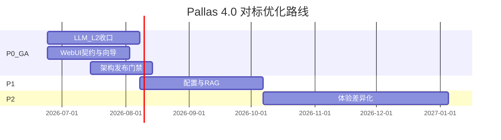

# Pallas 4.0 前辈对标分析与优化路线图

> **版本**：2026-06-24  
> **对标对象**：`/tmp/MaiBot`、`/tmp/gsuid_core` + `/tmp/gsuid_hub`、`/tmp/AstrBot`、`/tmp/zhenxun_bot`  
> **配套文档**：[逐文件 diff 补充](benchmark-peer-bots-file-diff.md)  
> **Notion 里程碑**：[4.0 前辈对标优化路线](https://app.notion.com/p/389943646d1081ef8b70f267662f2911)（43 项 OPT 任务已挂接）

---

## 0. 文档用途

本文是 4.0 收口阶段的**对标决策与实施清单**唯一仓库入口，与 Notion「任务」库双线同步：

- **本文**：分析结论、优先级、完整项目 ID、DoD、依赖关系。
- **Notion**：可执行 task、状态跟踪、里程碑归属。
- **file-diff 文档**：按能力域的逐文件路径对照，供开发时查阅。

---

## 1. 定位锚点（学什么、不学什么）

| 维度 | Pallas 4.0 已确立 | 前辈典型取向 | 策略 |
|------|-------------------|--------------|------|
| 产品核心 | 语料底盘 → 牛格/群味 → LLM 增强 | AstrBot/GsUID：AI-first；MaiBot：companion | **深化群社交差异化**，不转 AI 控制台 |
| 运行时 | Bot（策略）+ AI（执行）+ WebUI（治理）三仓 | 真寻/GsUID：单仓重 WebUI | **保持双仓 AI Runtime** |
| 插件 | core / official / community + cmd_perm + 分片 | 真寻元数据驱动；GsUID SV 自研 | **保持 NoneBot 生态 + 治理** |
| 独有强项 | ingress 多牛、语料联邦、repeater 主路径、分片 hub/worker | — | **对外叙事与文档化** |

**一句话**：向 AstrBot/GsUID 学 AI 运维面与工程纪律；向 MaiBot 学社交决策与记忆产品化（裁剪 20%）；向真寻学配置即 UI；**不学**单仓 AI-first 吞掉 Bot 边界。

---

## 2. 横向能力矩阵

| 能力 | AstrBot | GsUID | MaiBot | 真寻 | Pallas 4.0 |
|------|---------|-------|--------|------|------------|
| WebUI | Vue3+Vuetify，OpenAPI-first | hub 分仓，DynamicConfigPanel | React，记忆/Planner 运维极重 | 独立 WebUI + dist 拉取 | Vue3 独立仓，面宽，契约待 codegen |
| 配置→UI | schema + 多 Profile | Gs*Config → 动态表单 | TOML + 资源型 Persona | RegisterConfig → 自动表单 | env_sections，**渐进兜底弱** |
| LLM Provider | 50+ adapter，多模态 Manager | ai_core 按需加载 | 多 model/task 拆分 | services/llm 内核 | capability 契约，**L2 未全收口** |
| Agent/Tools | Pipeline + Main Agent + MCP | pydantic-ai + Kanban | Planner + Timing Gate | smart_tools | ToolRegistry + kernel（**replay 未验收**） |
| RAG/记忆 | FAISS+BM25+RRF | Qdrant + 图谱 | A_Memorix | memory 可插拔 | 关键词 RAG 首版 |
| 插件运维 | 市场 + pip 智能装 | Git 热重载一体 | 子进程 IPC | 商店 + WebUI | 官方/社区商店，**治理 UI 曾缺口** |
| 架构特色 | EventBus + Pipeline | WS 上游 + core | Heart Flow Runtime | PriorityLifecycle | **ingress + 分片 + callback** |

---

## 3. Pallas 相对优势（须保持）

1. **ingress 三层 + 多牛 fanout + 分片 Redis 协调** — 五位前辈均无同等深度。
2. **core / official / community 三层 + activation_policy** — 玩法不回流大一统 core。
3. **AI Runtime 双仓契约** — draw/sing L1 E2E 已签收；按需部署优于单仓内嵌。
4. **槽位 API** — `import_plugin_submodule`、`media_task_hooks`、duplicate prefix 自检。
5. **热重载分级 + reload_policy** — 配置/元数据 production-ready。
6. **测试规模** — shard/ingress/plugin_reload 覆盖显著领先前辈（除 AstrBot 部分模块）。
7. **Persona 深度** — affect、群 profiler、expression habits 领先 MaiBot/GsUID 的 prompt 层。

---

## 4. 缺口总览（按域）

### 4.1 WebUI

| 缺口 | 前辈参考 | 优先级 |
|------|----------|--------|
| OpenAPI 导出 + 前端 codegen | AstrBot `openspec/openapi-v1.yaml` | P0 |
| AI 运行态一屏（Runtime Overview） | GsUID Dashboard + AstrBot Stats | P0 |
| 首次 Setup Wizard + AI 体检向导 | MaiBot `/setup`、GsUID `ai_wizard_api` | P0 |
| 窄屏 ≤560px 审计（cmd 矩阵、插件配置） | Pallas AGENTS 已有规范 | P0 |
| Token/调用细粒度表格 | GsUID session log、AstrBot provider stats | P1 |
| DynamicConfigPanel（schema→UI） | GsUID、真寻 RegisterConfig | P1 |
| SSE Last-Event-ID 断线续传 | AstrBot logs SSE | P1 |
| vue-i18n 骨架 | GsUID 三语 | P2 |
| 插件安装进度 SSE | MaiBot `plugin/progress.py` | P2 |

### 4.2 LLM / AI

| 缺口 | 前辈参考 | 优先级 |
|------|----------|--------|
| L2：LLM capability 信封统一（7.3） | AstrBot capability 语义 | **P0（4.0 GA）** |
| L2：插件熔断去重，health 单一事实源（7.5） | AstrBot provider health | **P0** |
| L2：memory infra 终态（7.6） | MaiBot A_Memorix、GsUID memory | **P0** |
| hybrid RAG（embedding） | AstrBot/GsUID | P1 |
| heartbeat/proactive 统一 emitter | GsUID `proactive/emitter`、MaiBot timing_gate | P1 |
| agent loop trace / replay 验收 | GsUID Traces、AstrBot agent events | P1 |
| streaming @聊天 | AstrBot SSE chat | P2 |
| MCP transport 扩展（SSE/HTTP） | AstrBot mcp_client | P2 |

### 4.3 架构

| 缺口 | 前辈参考 | 优先级 |
|------|----------|--------|
| PyPI `pallas-core` + 文档路径统一 | 真寻 pip 生态 | P0（4.0 GA） |
| dev → main 合并 + 迁移指南 | — | P0 |
| 热重载 pre-reload 清理清单 | GsUID `reload_plugin.py` | P1 |
| 社区商店安装进度/回滚 UX | 真寻 StoreManager、MaiBot progress | P1 |
| 单一 Lifecycle 门面文档/代码 | AstrBot `core_lifecycle.py` | P2 |
| ingress 阶段序 maintainer 文档 | AstrBot pipeline stage_order | P2 |
| multi_bot_social 品牌契约总述 | — | P2 |

---

## 5. 完整实施清单

> **ID 规则**：`OPT-{WEB|LLM|ARCH|DOC}-{序号}`  
> **阶段**：P0 = 4.0 GA 门禁；P1 = 4.0.x；P2 = 4.1+  
> **状态**：文档落盘时为 Planned

### 5.1 P0 — 4.0 GA 门禁（2026-Q3）

| ID | 名称 | Repos | 类型 | 依赖 | Definition of Done |
|----|------|-------|------|------|-------------------|
| OPT-LLM-001 | LLM Bot→AI capability 信封统一 | Bot, AI | Refactor | — | 所有 LLM 请求走统一 request 外壳；legacy `/ollama/*` 隔离或移除；`pallas-ai-implementation.md` 7.3 勾选 |
| OPT-LLM-002 | 插件侧熔断去重，AI health 单一事实源 | Bot, AI | Refactor | OPT-LLM-001 | draw/sing/llm 不再维护 parallel circuit；WebUI/probe 只读 AI `/health`；7.5 勾选 |
| OPT-LLM-003 | memory infra 最小集收口 | Bot, AI | Feature | — | 运行时 session/task state 归 AI 仓；Bot relationship_notes 二级来源文档化；7.6 可验收 |
| OPT-LLM-004 | AI Runtime Overview 一屏 | Bot, WebUI | Feature | OPT-LLM-002 | WebUI 单页展示 LLM/image/sing health、queue、degraded、circuit；维护者 30s 判断全局状态 |
| OPT-WEB-001 | OpenAPI 导出与版本化 | Bot, Docs | Architecture | — | `openspec/pallas-console-v1.yaml` 或等价导出；路由 `/api/v1` 别名策略文档化 |
| OPT-WEB-002 | WebUI OpenAPI codegen 客户端 | WebUI | Refactor | OPT-WEB-001 | `consoleApi.ts` 核心域改用生成 client；CI 校验 drift |
| OPT-WEB-003 | 首次 Setup Wizard（改密+协议+LLM） | Bot, WebUI | Feature | — | `setup_state` 持久化；未完成强制引导；MaiBot 三步步长对标 |
| OPT-WEB-004 | AI 配置体检向导 | Bot, WebUI | Feature | OPT-LLM-004 | `GET .../llm/wizard/status` + Dialog；覆盖 provider/模型/连通性 |
| OPT-WEB-005 | 窄屏 ≤560px 审计与修复 | WebUI | Fix | — | cmd 矩阵、PluginConfigWorkspace、PluginStore 通过 AGENTS 清单；无横向溢出 |
| OPT-ARCH-001 | PyPI pallas-core 预发布 | Bot, Docs | Ops | — | `pallas.api` 稳定面；扩展模板 Cookbook 路径统一；`pallas-package-layout.md` P5 可勾选 |
| OPT-ARCH-002 | 4.0 dev→main 合并与迁移指南 | Bot, Docs | Docs | OPT-LLM-001 | CHANGELOG、guide/4.0-start 更新、已知限制列表 |
| OPT-ARCH-003 | duplicate prefix strict 门禁 | Bot | Feature | — | 生产文档推荐 `PALLAS_DUPLICATE_PREFIX_STRICT=true`；7.7 可勾选 |
| OPT-DOC-001 | 前辈对标报告与清单落盘（本文） | Docs | Research | — | 本文 + file-diff 文档；architecture README 链接 |

### 5.2 P1 — 4.0.x 产品化（GA 后 1～2 迭代）

| ID | 名称 | Repos | 类型 | 依赖 | Definition of Done |
|----|------|-------|------|------|-------------------|
| OPT-WEB-010 | Token/调用细粒度运维表格 | Bot, WebUI | Feature | OPT-LLM-004 | per-provider/per-plugin 时序表；对接 `llm_daily_stats_store` |
| OPT-WEB-011 | DynamicConfigPanel 通用组件 | Bot, WebUI | Feature | — | Pydantic `json_schema_extra` 约定；unexpected key 兜底；插件作者文档 |
| OPT-WEB-012 | SSE 日志 Last-Event-ID | Bot, WebUI | Feature | — | `/logs/stream` 支持断线续传；LogsPage 对接 |
| OPT-WEB-013 | API 错误响应统一包装 | Bot | Refactor | OPT-WEB-001 | `{ ok, data, error }` 或等价；新路由默认采用 |
| OPT-WEB-014 | 插件配置 TOML/源码双模式 | WebUI | Feature | — | 可视化与 raw 编辑切换；离开未保存拦截（参考 MaiBot） |
| OPT-LLM-010 | hybrid RAG MVP（embedding） | Bot, AI | Feature | — | `knowledge/retrieve.py` 可插拔 vector 后端；AI 仓 embedding API |
| OPT-LLM-011 | heartbeat/proactive 统一 emitter | Bot | Feature | — | 定时/主动消息单出口；与 governance 共用限流；参考 GsUID |
| OPT-LLM-012 | ToolRegistry replay 验收 | Bot, WebUI | Feature | — | `agent-runtime-toolregistry-replay-plan.md` 全部 Step 勾选 |
| OPT-LLM-013 | LLM circuit 与 routing fallback | Bot, AI | Feature | OPT-LLM-002 | health 连续失败拒单 + 用户文案；`task_routing` 显式 fallback 链 |
| OPT-LLM-014 | MCP transport 扩展 | Bot | Feature | — | stdio 之外 SSE/HTTP；安全 allowlist |
| OPT-ARCH-010 | 热重载 pre-reload 清理清单 | Bot, Docs | Docs | — | scheduler/HTTP mount/coord 检查项；WebUI 按 activation_policy 提示 |
| OPT-ARCH-011 | 社区商店安装进度 SSE | Bot, WebUI | Feature | — | 安装/更新 WebSocket 或 SSE；失败回滚提示 |
| OPT-ARCH-012 | ingress 阶段序 maintainer 文档 | Docs | Docs | — | gate→route_index→lanes→send_queue 一页图 |
| OPT-DOC-010 | multi_bot_social 品牌契约总述 | Docs | Docs | — | 舰队/主持牛/fanout 维护者入口 |

### 5.3 P2 — 4.1+ 体验与差异化

| ID | 名称 | Repos | 类型 | 依赖 | Definition of Done |
|----|------|-------|------|------|-------------------|
| OPT-WEB-020 | vue-i18n 骨架（zh/en） | WebUI | Feature | — | sidebar/login/plugins 三域可切换 |
| OPT-WEB-021 | 维护者 Chat 调试室 | Bot, WebUI | Feature | OPT-LLM-012 | 连 kernel trace；非群聊替代 |
| OPT-WEB-022 | 日志 WebSocket 备选端点 | Bot | Feature | — | 难缠反代环境可用 `/logs/ws` |
| OPT-WEB-023 | 插件自定义 Page 桥接 | Bot, WebUI | Feature | — | iframe + asset token；复杂插件专用页 |
| OPT-WEB-024 | API Key + scope（只读监控） | Bot | Feature | — | 第三方集成；参考 AstrBot open_api |
| OPT-LLM-020 | @聊天 streaming 分段输出 | Bot, AI, WebUI | Feature | — | AI SSE → Bot 分段发消息 |
| OPT-LLM-021 | callback 超时/dead-letter | Bot, AI | Feature | — | in-flight 可观测；orphan 任务清理 |
| OPT-LLM-022 | Session/Conversation 双层 | Bot | Feature | — | llm_chat 多对话窗口；级联清理 |
| OPT-LLM-023 | Timing Gate 可选策略 | Bot | Feature | OPT-LLM-011 | conversation-kernel 决策；默认 off |
| OPT-LLM-024 | persona bundle JSON schema 导出 | Bot, Docs | Docs | — | 跨站点人设资产标准 |
| OPT-ARCH-020 | 单一 Lifecycle 门面 | Bot | Refactor | — | `runtime/lifecycle.py` 阶段表 + startup_report |
| OPT-ARCH-021 | matcher 权限 prefilter | Bot | Refactor | — | 评估 Zhenxun HandlerActivationIndex 式优化 |
| OPT-ARCH-022 | dist 版本覆盖文档强化 | Docs | Docs | — | `data/pb_webui/public` vs 内置 dist 择优说明 |

### 5.4 P3 —  backlog（按需）

| ID | 名称 | 备注 |
|----|------|------|
| OPT-LLM-030 | 长期记忆图谱 UI | MaiBot 级；非 4.0 |
| OPT-WEB-030 | 完整 KB 文档管理 UI | 依赖 vector RAG 成熟后 |
| OPT-ARCH-030 | 插件子进程隔离 | MaiBot 式；与 NoneBot 热更冲突，长期评估 |

---

## 6. 路线图时间线

| 里程碑 | 目标日期 | 出口标准 |
|--------|----------|----------|
| **P0 完成（4.0 GA）** | 2026-08-31 | P0 清单全部 Done；`pallas-ai-implementation.md` L2 可勾选；dev 合 main |
| **P1 完成（4.0.x）** | 2026-10-31 | DynamicConfig、hybrid RAG MVP、replay 验收、商店进度 |
| **P2 完成（4.1）** | 2026-Q1 | i18n、streaming、Timing Gate 可选、Lifecycle 门面 |

---

## 7. 仓库分工速查

| 仓库 | P0 重点 | P1 重点 |
|------|---------|---------|
| **Pallas-Bot** | 7.3/7.5/7.6、setup API、OpenAPI 导出、strict 门禁 | DynamicConfig 元数据、proactive emitter、replay、ingress 文档 |
| **Pallas-Bot-AI** | capability 统一、health/metrics 聚合 API | embedding、routing fallback、circuit 状态 |
| **Pallas-Bot-WebUI** | Runtime Overview、setup wizard、AI wizard、窄屏审计、codegen | token 表、DynamicConfigPanel、SSE 续传 |
| **官方扩展** | config schema 元数据对齐 | 安装进度钩子 |

---

## 8. 与现有文档的关系

| 文档 | 关系 |
|------|------|
| [pallas-final-ai-shape.md](pallas-final-ai-shape.md) | AI 目标态；本路线 L2 项与之对齐 |
| [pallas-ai-implementation.md](pallas-ai-implementation.md) | Phase 7 进度表；P0 LLM 项即 7.3–7.7 |
| [pallas-core-contract.md](pallas-core-contract.md) | 治理/token/memory 缺口 |
| [agent-runtime-toolregistry-replay-plan.md](agent-runtime-toolregistry-replay-plan.md) | OPT-LLM-012 |
| [knowledge-source-rag.md](knowledge-source-rag.md) | OPT-LLM-010 |
| [benchmark-peer-bots-file-diff.md](benchmark-peer-bots-file-diff.md) | 逐文件路径对照 |

---

## 9. 修订记录

| 日期 | 说明 |
|------|------|
| 2026-06-24 | 初版：对标五前辈 + 全量清单 + Notion 双线 |
