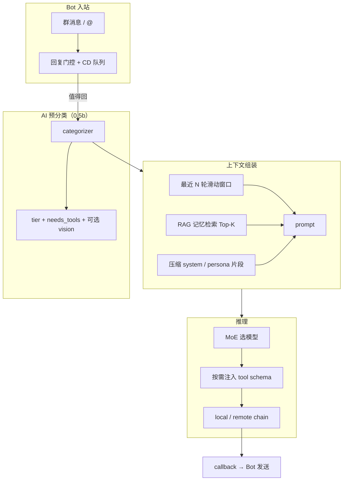
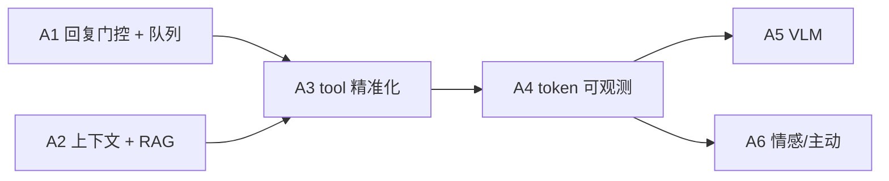

# LLM 省 Token 与拟人能力路线图

> **目标**：在保持 Pallas 人设与方舟 tool 能力的前提下，系统性降低 API/Ollama token 消耗，并吸收社区插件中可工程化的「拟人」设计。  
> **现行总纲**：见 [Pallas 核心契约](pallas-core-contract.md)。  
> **参考项目**：[nonebot-plugin-nyaturingtest](https://github.com/shadow3aaa/nonebot-plugin-nyaturingtest)（情感 / 记忆 / 回复门控）、[nonebot-plugin-moellmchats](https://github.com/Elflare/nonebot-plugin-moellmchats)（MoE / 预分类 tool / 上下文治理 / 可观测）。  
> **关联**：[persona-llm-roadmap](persona-llm-roadmap.md)、[AI 终态架构](pallas-final-ai-shape.md)、[arknights-knowledge-mcp](arknights-knowledge-mcp.md)；AI 仓实现阶段见 [Pallas-Bot-AI · platform-roadmap](https://github.com/PallasBot/Pallas-Bot-AI/blob/main/docs/architecture/platform-roadmap.md)。

## 1. 设计原则

1. **先少调用，再小上下文，再小模型**：门控 > 历史/RAG > MoE 分档 > `num_predict` 上限。
2. **分类与推理解耦**：`qwen2.5:0.5b`（或同类）**仅作 categorizer**；`simple` 推理档用于 **<3 字** @、`repeater_select` / **润色**（select **不经过** categorizer，见 [persona-llm-roadmap · P6′](persona-llm-roadmap.md)）。
3. **预分类 → 后注入 tool**：日常闲聊零 schema；`needs_tools=True` 时才注入对应 domain（与 moellmchats 同路，主仓已部分交付）。
4. **不挡热路径**：门控、记忆检索、token 统计走异步或 O(1) 内存计数；失败一律回退现网行为。
5. **配置落盘**：新开关优先 `pallas.toml` / `webui.json` / AI 仓 `providers.toml`；避免向 Bot 根 `.env` 扩散业务键（见 [settings-storage](settings-storage.md)）。

## 2. 当前基线（2026-06）

| 能力 | 状态 | 位置 |
| --- | --- | --- |
| MoE 三档 + categorizer | 已交付 | AI：`moe.py`、`categorizer.py`、`router.py` |
| simple 边界 <3 字 | 已交付 | AI：`categorize_request_tier` |
| @对话允许 simple 推理 | 已交付 | AI：`resolve_inference_tier`（仅 tool 抬 medium） |
| tool 选择性注入 | 已交付 | Bot `registry.tool_metadata_for_chat`；AI `resolve_tool_schemas` |
| tier→remote（complex） | 已交付 | AI：`LLM_MOE_TIER_REMOTE_TIERS` |
| 输出 token 上限 | 已交付 | Bot：`inference_params.py`（persona `length_pref`） |
| 历史封顶 | 已交付 | AI：`LLM_MAX_HISTORIES`；Bot PG `session_store` |
| 闲聊 CD / 并发 | 部分 | Bot：`governance.py` |
| 任务计数（非 token） | 已交付 | Bot/AI `task_metrics` + WebUI 面板 |
| 回复门控（潜水/不回） | **未做** | — |
| 记忆 RAG / 摘要 | **未做** | — |
| tool 黑名单 / 短描述 | **未做** | — |
| API token 消耗统计 | **未做** | — |
| VLM 按需 + 历史纯文本 | **未做** | — |

## 3. 借鉴矩阵

### 3.1 nyaturingtest — 值得学

| 能力 | 说明 | Pallas 落点 | 优先级 |
| --- | --- | --- | --- |
| **回复门控** | 不是每条 @ 都进 LLM；潜水/活跃态 | Bot：`llm_chat` 入口或 `ingress` 决策层 | **A1** |
| **HippoRAG 式记忆** | 检索相关片段，非全量历史 | Bot `session_store` + AI 检索接口 | **A2** |
| **聊天中提取知识** | 群梗/人设教导写入长期库 | Bot `persona` / 群风格 / 可选 KB | A3 |
| **情感三维模型** | 影响语气与回复欲望 | 已有 `affect` / persona；与门控联动 | A1/A3 |
| **多头牛性格分化** | 同群仍抽语料，但选句权重/原型差拉大 | `persona` archetype + triggers + scorer 内容标签 | **A6** |
| **预设分层** | role / knowledges / relationships / events / bot_self | 对齐 `compile_persona_prompt` 契约 | A3 |
| **calm / reset / status** | 运维口令 | 部分已有 `clear`；补 status 聚合 | A4 |

### 3.2 moellmchats — 值得学

| 能力 | 说明 | Pallas 落点 | 优先级 |
| --- | --- | --- | --- |
| **预分类-后注入 tool** | 一次性判难度+tool+视觉 | 已对齐；持续打磨 categorizer 提示词 | 维护 |
| **MoE 动态路由** | simple/medium/complex | 已对齐 | 维护 |
| **CD + 队列** | 冷却期间消息排队 | 加强 `governance` 队列合并 | **A1** |
| **群/用户双层上下文 + TTL** | 用户私上下文过期 | Bot `session_store` | **A2** |
| **tool 黑名单** | 禁止 LLM 调用某些插件 | Bot `tools/registry` + WebUI | **A3** |
| **插件描述覆写** | 更短更准的 function 描述 | `tool_schemas` 生成层 | **A3** |
| **常驻 vs 按需 tool** | 控制 schema 体积 | 配置项 `LLM_TOOLS_RESIDENT_DOMAINS` | A3 |
| **tool 轮次上限** | 防多轮刷 token | AI `LLM_TOOLS_MAX_ROUNDS` 收紧 + 日志 | **A3** |
| **VLM：有图才用视觉模型** | 历史回退纯文本 | 未来识图特性；先写契约 | A5 |
| **Token 消耗查询** | 超管可查 API token | AI 统计 + WebUI | **A4** |
| **刷新模型/工具热重载** | 运维 | 部分已有 | 维护 |

## 4. 目标架构

## 5. 分期交付

### Phase A1 · 少调用（最高 ROI）

**目标**：减少无效 LLM 请求；强化 CD 队列。

| 项 | 交付物 | 仓库 | 默认 |
| --- | --- | --- | --- |
| A1.1 | **回复门控**：基于消息类型（纯表情/过短/@质量）、群活跃度、可选情感分，判定 `skip` / `defer` / `proceed` | Bot `features/llm/reply_gate.py` + `llm_chat` 入口 | 关 |
| A1.2 | **CD 队列合并**：冷却窗口内多条 @ 合并为一次 completion（取最后一条或摘要） | Bot `governance.py` | 关 |
| A1.3 | **门控可观测**：`reply_gate_skip` / `defer` 计数进 task_metrics 或慢路径日志 | Bot | 开（仅计数） |

**配置键（草案）**：

| 键 | 说明 |
| --- | --- |
| `LLM_REPLY_GATE_ENABLED` | 是否启用回复门控 |
| `LLM_REPLY_GATE_MIN_CHARS` | 低于此长度且非 @ 强制 skip（默认 1，与 <3 字 simple 区分用途） |
| `LLM_CHAT_QUEUE_MERGE` | CD 期间是否合并请求 |

**验收**：

- [ ] 纯表情包 @ 不提交 AI（门控开）
- [ ] 冷却内连发 3 条只产生 1 次 Celery 任务（合并开）
- [ ] 门控关时与现网行为一致

---

### Phase A2 · 小上下文

**目标**：历史不无限涨；相关记忆按需检索。

| 项 | 交付物 | 仓库 | 默认 |
| --- | --- | --- | --- |
| A2.1 | **滑动窗口收紧**：`LLM_MAX_HISTORIES` 可 WebUI 配置；默认从 100 降到 **30** | AI + WebUI | 30 |
| A2.2 | **用户级 TTL**：N 小时无对话清空用户子上下文（群窗口保留） | Bot `session_store` | 关 |
| A2.3 | **记忆 RAG（MVP）**：群梗/教导/摘要条目 embedding 检索 Top-3 注入 system 附段，**不**追加全量历史 | Bot `features/llm/memory/` + 可选 AI 嵌入 API | 关 |
| A2.4 | **超长会话摘要**：历史达阈值时用 medium 模型异步摘要旧轮，替换为 1 条 system 摘要 | AI task + Bot 触发 | 关 |

**参考**：nyaturing HippoRAG；实现可先用 PG + 本地/硅基嵌入，不引入完整 HippoRAG 依赖。

**验收**：

- [ ] 50 轮对话后 prompt token 明显低于现网（采样日志对比）
- [ ] TTL 过期用户上下文不进入 `build_chat_messages`
- [ ] RAG 关时零行为变化

---

### Phase A3 · Tool 精准化

**目标**：减少误调用与多轮 tool 往返。

| 项 | 交付物 | 仓库 | 默认 |
| --- | --- | --- | --- |
| A3.1 | **tool 黑名单**：WebUI 禁用指定 tool / domain | Bot registry + WebUI | 空 |
| A3.2 | **schema 瘦身**：function `description` 长度上限；方舟 tool 用短描述模板 | Bot `tools/` | 开 |
| A3.3 | **常驻 domain 配置**：仅 `arknights` 等白名单常驻；其余按需 | Bot + AI metadata | selective |
| A3.4 | **tool 轮次与强制提醒**：`LLM_TOOLS_MAX_ROUNDS=2`；首轮未调用时启发式 `operator.get`（仅 arknights 查人） | AI `tool_loop` | 轮次 2 |
| A3.5 | **插件型 tool 描述覆写** | `data/llm_tool_overrides.json` | 可选 |

**验收**：

- [ ] 「你知道谁是银灰吗」稳定触发 `arknights.operator.get`
- [ ] 闲聊无「已启用工具调用」或 categorizer 判 false 时不注入
- [ ] 黑名单内 tool 不出现在 schema

---

### Phase A4 · 可观测与运维

| 项 | 交付物 | 仓库 |
| --- | --- | --- |
| A4.1 | **Token 统计**：AI 侧累计 `prompt_tokens` / `completion_tokens`（provider 返回时解析） | AI |
| A4.2 | **Bot 代理 + WebUI 表**：按 task/模型/日聚合 | Bot + WebUI |
| A4.3 | **`status` 口令/面板**：当前模型、tier 分布、近 1h token、门控 skip 率 | Bot `llm_chat` admin |
| A4.4 | **分类分布日志**：`tier` / `needs_tools` / `provider` 单行结构化 | AI（已有，补 metrics） |

**验收**：

- [ ] WebUI 可见今日 token 估算
- [ ] 与 moellmchats「查看消耗」能力等价（不要求指令形式一致）

---

### Phase A5 · 多模态（后置）

| 项 | 说明 |
| --- | --- |
| A5.1 | 有图消息强制视觉模型；**写入历史时剥离图片**，只留文本摘要 |
| A5.2 | categorizer 增加 `needs_vision` 字段 |
| A5.3 | MoE 增加 `vision` 档或独立 provider |

参考 moellmchats；Pallas 当前无 VLM，先预留 metadata 契约。

---

### Phase A6 · 情感与主动行为（后置）

| 项 | 说明 |
| --- | --- |
| A6.1 | 情感分影响门控阈值与 `temperature` |
| A6.2 | 低活跃时主动潜水，高活跃时可选主动搭话（ingress） |
| A6.3 | 预设分层：`knowledges` / `relationships` 独立 JSON，编译进 persona |
| A6.4 | **牛格 archetype 档**：`bot_id` 映射若干行为原型（如 terse / chaotic / polite），放大同群多头差异；与跨群 `cross_group` 画像叠加，**不替代**统计层 |
| A6.5 | **affect triggers 闭环**：完成 AI 仓 [persona-affect-refine M4](https://github.com/PallasBot/Pallas-Bot-AI/blob/main/docs/architecture/persona-affect-refine.md) 产出 → 写入 `style_profile.sample.affect_triggers` → 接话热路径子串命中调 persona（主仓骨架已有） |
| A6.6 | **scorer 候选内容加权**：候选句与 `affect_lexicon` / triggers 子串匹配时调整 `message_weight_multiplier`（如群偏「卧槽」时更易抽到含对应口癖的已学句）；**不**对每条候选调 LLM |
| A6.6b | **repeater select（P6′）**：scorer 缩 Top-K 后 **一次** LLM 按情绪/语境选编号；与 A6.6 本地加权互补，输出仍为语料原句（见 [persona-llm-roadmap](persona-llm-roadmap.md)） |
| A6.7 | **情感第三轴 + compile 分档**：在 warmth / assertiveness 外增 bluntness（或 formality）轴；`build_bot_behavior_prompt` 按区间输出 3~5 档文案，缩小现网 ±0.15 死区 |

参考 nyaturing；与 [group-style-persona](group-style-persona.md)、[persona-reply-style](persona-reply-style.md) 合并演进，避免两套人格系统。

**A6.4–A6.7 边界**（相对 4.0 已交付行为层）：

- 底层仍是 **语料命中 → 加权抽句**；archetype / 内容标签只改权重，不改 learn 与检索逻辑。
- 与 `fanout`（同 keywords 多头分化）、`cross_group_profiler`（不同群圈子拉开）并存；单牛仅混同一批群时，差异仍受语料池上限约束。
- 热路径 scorer 保持 **O(1) 词表 / trigger 命中**；**select** 为异步慢路径（与 polish 同级 token），不对每条接话做全量 persona 编译。
- LLM **选句 / 现编** 走 [persona-llm-roadmap](persona-llm-roadmap.md) P6′ / P5；**润色（polish）** 遗留，默认由 select 替代。

**验收（A6.4–A6.7）**：

- [ ] 同群两头牛（不同 `bot_id`）在相同 keywords 下，选句分布可观测差异（非仅 fanout 换句）
- [ ] triggers 开 + affect-refine 产出 phrase 后，命中用户消息时 warmth / assertiveness 偏移生效
- [ ] 候选池同时含 polite / harsh 句时，高 `harsh_msg_ratio` 群的 harsh 句权重上升
- [ ] `compile_persona_prompt` 在中等 warmth 区间也有分档文案，非全空

## 6. 推荐 PR 顺序

| 顺序 | PR 范围 | 预估 |
| --- | --- | --- |
| 1 | A3.4 银灰类查人稳定调 tool（小步） | 1 PR |
| 2 | A1.1 + A1.3 回复门控 + 指标 | 1 PR |
| 3 | A2.1 + A2.2 历史窗口 + TTL | 1 PR |
| 4 | A3.1–A3.3 tool 黑名单与 schema 瘦身 | 1 PR |
| 5 | A4.1–A4.2 token 统计与 WebUI | 1 PR |
| 6 | A2.3 记忆 RAG MVP | 1–2 PR |
| 7 | A6.4–A6.6 牛格分化（archetype + triggers + scorer 内容标签） | 1–2 PR |
| 8 | A6.1–A6.3 / A6.7 / A5 按需 |

## 7. 文件触达清单

### Pallas-Bot（主仓）

| 路径 | Phase |
| --- | --- |
| `src/features/llm/reply_gate.py`（新） | A1 |
| `src/features/llm/governance.py` | A1 |
| `src/features/llm/session_store.py` | A2 |
| `src/features/llm/memory/`（新） | A2 |
| `src/features/llm/tools/registry.py` | A3 |
| `src/features/llm/tools/select.py` | A3 |
| `src/plugins/llm_chat/chat_message.py` | A1 |
| `src/features/persona/auto.py` | A6.4 |
| `src/features/persona/scorer.py` | A6.5/A6.6 |
| `src/features/persona/affect_triggers.py` | A6.5 |
| `src/features/persona/affect_lexicon.py` | A6.6 |
| `src/features/persona/compile_persona_prompt.py` | A6.7 |
| `src/plugins/repeater/responder.py` | A6.6 |
| `src/console/webui/extended_api.py` | A3/A4 |
| `docs/plugins/llm_chat/README.md` | 各期 |

### Pallas-Bot-AI

| 路径 | Phase |
| --- | --- |
| `app/providers/categorizer.py` | 维护 |
| `app/providers/tool_loop.py` | A3 |
| `app/services/llm_messages.py` | A2 |
| `app/services/llm_token_metrics.py`（新） | A4 |
| `app/tasks/llm/chat_tasks.py` | A2/A4 |

### Pallas-Bot-WebUI

| 路径 | Phase |
| --- | --- |
| `src/components/LlmModelAdminPanel.vue` | A2/A4 |
| 新增「LLM 门控 / 记忆 / Tool」配置段 | A1–A3 |

## 8. 配置速查（目标态）

| 键 | 默认 | Phase | 说明 |
| --- | --- | --- | --- |
| `LLM_MAX_HISTORIES` | 30 | A2 | 会话轮数上限 |
| `LLM_SESSION_USER_TTL_HOURS` | 0（关） | A2 | 用户上下文 TTL |
| `LLM_REPLY_GATE_ENABLED` | false | A1 | 回复门控 |
| `LLM_CHAT_QUEUE_MERGE` | false | A1 | CD 合并 |
| `LLM_TOOLS_MAX_ROUNDS` | 2 | A3 | tool 多轮上限 |
| `LLM_TOOLS_BLOCKED` | 空 | A3 | 黑名单 tool 名 |
| `LLM_MEMORY_RAG_ENABLED` | false | A2 | 记忆检索 |
| `LLM_TOKEN_STATS_ENABLED` | true | A4 | token 累计 |
| `PERSONA_ARCHETYPE_ENABLED` | false | A6.4 | 启用 bot 行为原型档 |
| `PERSONA_SCORER_CONTENT_TAGS_ENABLED` | false | A6.6 | 候选句口癖/词表加权 |

## 9. 非目标（本路线不做）

- 完整移植 nyaturing 预设文件格式或 AGPL 代码块
- 完整移植 moellmchats 的 `custom_tools/` Python 函数热加载（Pallas 已有 Bot 侧 tool registry，不重复造轮子）
- 联网搜索（Tavily）；与方舟 KB 正交，单独立项
- 替换现有 persona 统计层

## 10. 相关文档

- [persona-llm-roadmap](persona-llm-roadmap.md) — LLM 总路线图
- [AI 终态架构](pallas-final-ai-shape.md) — 跨仓契约
- [arknights-knowledge-mcp](arknights-knowledge-mcp.md) — 方舟 tool
- [plugins/llm_chat/README.md](../plugins/llm_chat/README.md) — 插件说明
