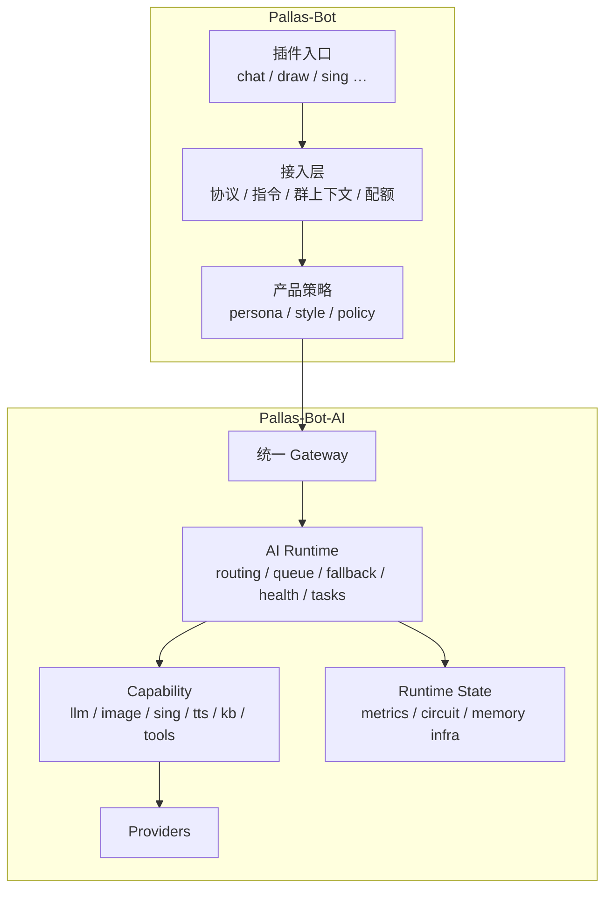

# Pallas AI 终态架构

> **本文是 AI 相关架构的唯一「目标态」入口**：双仓边界、统一运行时、能力规格、Bot↔AI 契约。  
> **现行总纲**：见 [Pallas 核心契约](pallas-core-contract.md)。  
> 分阶段落地、联调签收、local 覆盖见 **[pallas-ai-implementation.md](pallas-ai-implementation.md)**。  
> LLM / persona 语言层细节仍见 [persona-llm-roadmap.md](persona-llm-roadmap.md)。

## 1. 结论

Pallas 需要 **独立治理的 AI Runtime**（`Pallas-Bot-AI`），理由不是「按需安装」，而是 `chat` / `draw` / `sing` 与 persona / memory 需要统一 provider、health、task、错误语义。

| 仓库 | 一句话 |
|------|--------|
| **Pallas-Bot** | 为什么在这里、对这个人、做这件事（接入、权限、冷却、persona/style、文案） |
| **Pallas-Bot-AI** | 如何稳定地把这件事做成（provider、routing、queue、task、熔断、回调） |

**组织方式**：短中期维持 **双仓双发布**；长期可演进到同生态多包（用户视角一套 Pallas，部署仍可拆进程）。  
**按需启用**：不用 AI → 不装 AI 套件；要 chat 不要媒体 → 只开对应 capability——由安装模板与 WebUI 开关解决，不靠拆散架构文档。

## 2. 目标形态



### 2.1 主仓负责

- 协议、命令、权限、冷却、群配额
- persona 编排、`group style` 统计与解释
- 触发 chat / draw / sing 的业务条件
- 参考图提取、QQ 头像等 **平台侧** 逻辑（URL 交给 AI，不在上游直传鉴权 CDN）
- 消息发送、callback 消费、用户可见文案
- WebUI **聚合** 运行态（事实源在 AI 仓）

### 2.2 主仓不应长期负责

- 多供应商 fallback 编排、backend 熔断记忆
- draw/sing/chat 各自独立的 provider 健康运行时
- 复杂媒体任务执行与上游差异兼容

### 2.3 AI 仓负责

- LLM / image / sing·tts / kb / tools runtime
- provider registry、routing / chain / fallback
- queue、timeout budget、circuit breaker
- task 生命周期与 callback
- health / diagnostics / metrics
- 会话与 **运行时** 记忆基础设施

### 2.4 persona / style / memory

| 概念 | 位置 |
|------|------|
| **style**（群习惯、节奏） | 统计与解释在主仓；snapshot 作 metadata 下发 AI |
| **persona**（产品人格） | 定义与 `compile_persona_prompt` 在主仓；AI 只收 `system` / 版本号 |
| **产品记忆**（关系、偏好） | 策略在主仓；存储检索基础设施可在 AI 仓 |
| **运行时记忆**（session、窗口、task state） | AI 仓 |

## 3. 统一运行时

`chat` / `draw` / `sing` **共享治理语义**，不必共用一个 HTTP path。

### 3.1 核心概念

- **Capability**：对外能力单元（`llm.chat`、`image.generate`、`media.sing` …）
- **Provider**：实现来源（ollama、openai_compatible、image_gateway、local_worker …）
- **Backend**：provider 下可治理的实例（熔断、latency、health 在 backend 级）
- **Request**：`request_id` + `capability` + `caller` + `context` + `policy` + `payload`
- **Result**：`result_state`（`success` | `accepted` | `failed`）+ provider/backend + data 或标准 error
- **Task**：慢路径统一 `pending → queued → running → succeeded|failed`

### 3.2 能力模式

| 模式 | 特点 | 典型 capability |
|------|------|-----------------|
| **Sync** | 低延迟、同步返回 | `llm.chat`、快图、短 TTS |
| **Async** | 必须 task + queue/callback | `media.sing`、长媒体 |
| **Hybrid** | 快路径 sync、慢路径自动 task | **`image.generate`** |

上层插件不应自行决定 hybrid 切换细节；Bot 只传 policy hint（如 timeout），AI Runtime 选 sync 或 task。

### 3.3 统一错误分类（failure_class）

`timeout` · `connect_error` · `provider_unavailable` · `unsupported_operation` · `invalid_upstream_response` · `runtime_overloaded` · `rate_limited` · `task_failed` · `internal_error`

### 3.4 统一健康语义

- **health_state**：`healthy` | `degraded` | `unhealthy` | `unknown`
- **circuit_state**：`closed` | `open` | `half_open`
- **degraded_state**（聚合）：`normal` | `degraded` | `busy` | `overloaded`

## 4. Bot ↔ AI 契约

配置：`AI_SERVER_HOST` / `AI_SERVER_PORT`（默认 `127.0.0.1:9099`）。分片 hub 转发 AI callback 不变。

### 4.1 端点（按 capability，语义统一）

| Capability | 典型路径 | 模式 |
|------------|----------|------|
| `llm.chat` | `POST /api/v1/chat/completions`（或 AI 仓等价路径） | sync / 异步 callback |
| `image.generate` | `POST /api/images/generate` | sync（快路径） |
| `image.generate` 慢路径 | `POST /api/media/tasks` | async + callback |
| `media.sing` | `POST /api/media/tasks` | async + callback |
| 运行态 | `GET /health`、`GET /api/images/runtime`、`GET /api/media/tasks/runtime` | — |
| 回调 | AI → Bot `POST /callback/{task_id}` | — |

Legacy `/api/ollama/*`：兼容期保留，新能力禁止再增 ollama 专用路径。Chat provider 与模型选型见 [persona-llm-roadmap.md](persona-llm-roadmap.md)。

### 4.2 请求外壳（所有 capability 共用）

```yaml
request_id: string          # 必填
capability: string          # 必填，如 image.generate
caller:                     # 必填
  source: bot
  bot_id: int
  plugin: string
context:                    # 按需
  group_id / user_id / session_id / persona_version / metadata
policy:                     # 运行时 hint，非业务策略替代品
  timeout_sec / allow_fallback / prefer_local / max_latency_ms / deliver_mode
payload: {}                 # capability 专有
```

Bot 侧上下文必须走 `context`，persona/style 走 metadata，不得隐式依赖插件私有字段。

### 4.3 `image.generate` payload 要点

| 字段 | 说明 |
|------|------|
| `prompt` | 必填 |
| `reference_urls` | Bot 传入可访问 URL（含 QQ CDN、data URL）；**AI 仓负责下载**，有参考图时走上游 **`/v1/images/edits` multipart**，不将 URL 原样转给无法鉴权的上游 |
| 无参考图 | AI 仓走 **`/v1/images/generations` JSON** |
| 上游返回 | 兼容 `b64_json` 与 `url`（`url` 时 AI 仓再下载转 b64） |

Draw 插件 runtime mode：

- `plugin_runtime`：插件本地下载 + 直连网关（兼容/兜底）
- `ai_service_runtime`：只调 AI 仓；配额、冷却、文案仍在插件

慢路径触发（联调约定）：**有参考图**，或超时预算 **≥ 90s** → `POST /api/media/tasks` + callback，先回「欢呼吧！」再异步出图。

### 4.4 失败结果形状

```yaml
result_state: failed
error:
  code: string
  message: string
  retryable: bool
  failure_class: string   # 见 §3.3
```

## 5. 插件终态

| 插件 | 终态 |
|------|------|
| **draw** | 薄入口：解析消息 → 调 AI Runtime → 发图；不重维护多网关编排 |
| **sing** | 薄入口 + `legacy` / `media_task` 双模式，收敛到统一 media task |
| **llm_chat / chat / repeater** | 经 `features/llm` 调 AI 仓统一 Chat API |

新能力默认：**先接 AI Runtime capability**，不在插件内复制 provider 治理。

## 6. 站点 `local/plugins` 与内核

整包覆盖同名插件时，NoneBot 只加载 local 槽位；内核若仍 `import src.plugins.<名>`，会出现命令走 local、callback/WebUI/probe 走主仓的 **分裂**。

终态要求：

- 内核通过 **`import_plugin_submodule(plugin_id, submodule)`** 解析 **已加载** 插件包
- 媒体 task callback 通过 **`media_task_hooks`** 按 `task_type` 注册，runner 不 inline 插件扣次逻辑
- draw 等 `__init__.py` 薄化，避免 import 子模块时重复注册 matcher
- 启动扫描重复 command prefix（可选 `PALLAS_DUPLICATE_PREFIX_STRICT=true` 硬失败）

落地进度与验收见 [pallas-ai-implementation.md](pallas-ai-implementation.md) §4。

## 7. 借鉴与终局一句话

- **Gsuid**：内核纪律、插件边界  
- **AmiyaBot / zhenxun**：核心 + 插件 + 控制台生态  
- **AstrBot**：AI-first 中心化 runtime  
- **MaiBot**：persona / memory / 陪伴感  

> Pallas 的终态不是「带 AI 的 Bot」，而是 **有社交外壳与人格策略的统一 AI 体**。

## 相关文档

- **[pallas-ai-implementation.md](pallas-ai-implementation.md)** — 分阶段路线、进度、E2E 联调、槽位覆盖清单  
- [persona-llm-roadmap.md](persona-llm-roadmap.md) — LLM / Chat API / provider  
- [pallas-4.0-roadmap.md](pallas-4.0-roadmap.md) — 4.0 总路线图  
- [site-customization-and-updates.md](site-customization-and-updates.md) — `local/plugins` 用法  
