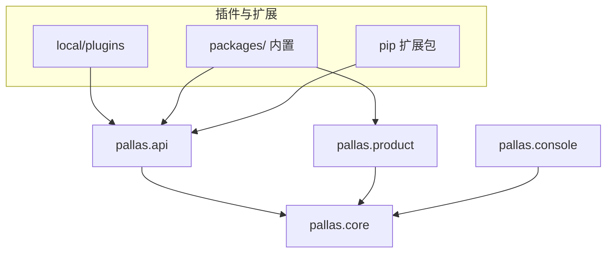

# Pallas 包布局与公开 API

> **状态**：布局迁移已落地（4.0.0）· **文档同步与 PyPI 发布仍在途**  
> **目的**：把「对内六层 `src/`」收口为社区可依赖的 **`pallas` 包 + 单一 `api` 入口**，内置/社区插件与内核实现物理分离。  
> **关系**：[Pallas 核心契约](pallas-core-contract.md)（产品与边界）· [common-layers](common-layers.md)（4.x 历史分层 → 现行 `pallas/core`）· [plugin-governance-community-roadmap](plugin-governance-community-roadmap.md)（治理与 L1/L2）· [core-devx-roadmap](core-devx-roadmap.md)（SDK 与 golden 插件）

## 1. 背景与问题

4.x 已在 `src/` 下建立 `foundation` / `platform` / `features` / `console` / `domain` / `shared` 六层，**对主仓维护者清晰**，但对社区插件作者仍是灾难：

| 现象 | 后果 |
| --- | --- |
| 公开面散落在 `src.features.*`、`src.console.*`、`src.foundation.*` | 作者不知道哪些是稳定契约、哪些是内部实现 |
| `plugin_sdk` 只覆盖口令注册一小部分 | Cookbook 仍教深层 import（配置、存储、路径各在不同层） |
| 业务在 `features/`，壳在 `plugins/`（如 corpus ↔ repeater） | 维护者改功能时要在两层之间跳转 |
| 内置插件与内核同处 `src/plugins/` | 「插件目录」与「框架源码」视觉混在一起 |
| 扩展 pip 包与主仓共用 `from src.*` | 版本升级时 import 路径无 semver 保障 |

参照项目共性：**GsUID / AstrBot 用独立包名 + 插件外挂目录；真寻把功能插件迁出本体；MaiBot 把第三方插件放在仓库根 `plugins/`。**  
Pallas 4.0 不照搬 GsUID 双进程，也不推翻 NoneBot 运行时；重点是 **AstrBot 式 `api`/`core` 硬隔离 + 插件出 `src`**（已落地）。

## 2. 设计目标

| 维度 | 4.0 目标 | 验收 |
| --- | --- | --- |
| 单一入口 | 社区文档与 L1 校验只认 `pallas.api.*` | Cookbook / 扩展模板零 `src.` import |
| 可安装内核 | PyPI wheel **`pallas-core`**（包内命名空间 `pallas`） | 扩展 `pyproject.toml` 声明 `pallas-core>=4.0` |
| 物理分离 | 内核在 `pallas/`，插件在 `packages/` + `local/plugins/` | `pallas/` 树内无 `plugins/` |
| 壳业务可预期 | 内置插件要么自包含，要么显式依赖 `pallas.product.*` | 每个 `pb_*` 有 README 说明边界 |
| Breaking 一次做完 | 4.0 统一迁路径，不长期双轨 | 3.x 最后一版发 migration 说明 |

## 3. 目标目录

### 3.1 仓库根（部署应用 `pallas-bot`）

```text
Pallas-Bot/
├── bot.py                    # 薄壳：nonebot init → pallas.runtime.boot()
├── config/                   # pallas.toml（不变）
├── data/                     # 运行时（不变）
├── local/plugins/            # 站点 / 社区插件（不变，最高优先）
├── packages/                 # ★ 内置插件（原 src/plugins/）
│   ├── pb_core/
│   ├── repeater/
│   └── ...
├── pallas/                   # ★ 内核 Python 包（发布为 pallas-core）
└── pyproject.toml            # 应用依赖 pallas-core；nonebot plugin_dirs → packages/
```

### 3.2 内核包 `pallas/`

```text
pallas/
├── __init__.py               # __version__；不 re-export 内部模块
├── api/                      # ★ 插件作者唯一文档入口（稳定 semver）
│   ├── commands/             # 口令注册、PluginHandlerContext
│   ├── config/               # install_hot_reload_config
│   ├── storage/              # GroupPluginStorage、声明 helper
│   ├── perm/                 # command_perm_*、运行时鉴权
│   ├── limits/               # command_limits、CD helper
│   ├── metadata/             # usage_line、PLUGIN_EXTRA_VERSION、SCENE_*
│   ├── paths/                # plugin_data_dir、resource_dir
│   └── constants/            # 帮助/菜单模板常量（可选）
├── core/                     # ★ 内部实现；插件与 local/ 禁止 import
│   ├── foundation/           # 原 src/foundation
│   ├── platform/             # 原 src/platform
│   └── runtime/              # plugin_loader、kernel_runtime、boot 链
├── product/                  # 产品域（原 src/features 中 corpus/persona/llm 等）
│   ├── corpus/
│   ├── persona/
│   ├── llm/
│   └── ...
├── console/                  # WebUI 后端（维护者向；不进 api）
├── domain/                   # arknights 等域共享
└── shared/                   # 内核内部工具；不进 api
```

### 3.3 与参照项目对照

| 参照 | 做法 | Pallas 5.x 对应 |
| --- | --- | --- |
| AstrBot | `astrbot/api` vs `astrbot/core` | `pallas/api` vs `pallas/core`（已落地） |
| GsUID | 外挂 `plugins/` volume | `local/plugins/` + `packages/`（已落地） |
| 真寻 | 本体瘦、插件独立仓 | 继续 pip 扩展 + 社区 Git 索引 |
| MaiBot | 根级 `plugins/` 放第三方 | `local/plugins/` 已在根级 |
| AmiyaBot | pip 框架 + 薄 `__init__.py` | golden 模板 + `pallas.api.commands` |

## 4. 依赖与 import 规则

### 4.1 允许的方向



- **社区 / pip 扩展**：仅 `pallas.api.*`（L1）；L2 可用 `api` 内 perm/limits/storage，仍禁止 `core`。
- **内置 `packages/`**：可用 `pallas.api.*` + **`pallas.product.*`**（产品 hook，文档白名单）；禁止 `pallas.core.*` 深层文件。
- **主仓 `pallas/core|console|product`**：可互相按现有分层依赖方向（见 [common-layers](common-layers.md) 映射表）。

### 4.2 硬禁令（CI  enforce）

| 来源 | 禁止 import | 级别 |
| --- | --- | --- |
| `local/plugins/**` | `pallas.core.*`、`pallas.console.*`、`pallas.product.*` | **error** |
| `packages/**` | `pallas.core.*` 深层（非 `pallas.core.runtime` 暴露的 boot hook） | **error** |
| pip 扩展 `src/**` | 同上 | **error** |
| 任意插件 | `src.*`（4.0 起） | **error** |
| `local/plugins/**` | 未在 api 白名单的 `pallas.*` 子模块 | **warn → 4.1 error** |

实现方式：`tools/check_plugin_imports.py` + pre-commit / CI；`community_plugin_author check` 复用同一规则。

## 5. 公开 API 白名单（`pallas.api`）

以下为 **4.0 已冻结** 的插件面向符号。新增符号须在本表登记并在 minor 版本发布说明中注明。

### 5.1 `pallas.api.commands`

| 符号 | 4.x 路径 |
| --- | --- |
| `group_command`, `private_command`, `message_command` | `src.features.plugin_sdk` |
| `PluginCommand`, `PluginHandlerContext` | 同上 |
| `bind_alias_handlers` | 同上 |
| `missing_command_declarations` | 同上 |

### 5.2 `pallas.api.config`

| 符号 | 4.x 路径 |
| --- | --- |
| `install_hot_reload_config` | `src.console.webui` |
| `PluginWebuiConfigHandle`, `get_config` 模式（文档约定） | 同上 |

维护者向：`register_plugin_webui_config` 等 **不** 进入 api，留在 `pallas.console`。

### 5.3 `pallas.api.storage`

| 符号 | 4.x 路径 |
| --- | --- |
| `GroupPluginStorage`, `DeployPluginStorage` | `src.features.plugin_storage` |
| `plugin_storage_list`, `plugin_storage_row` | 同上 |
| `get_plugin_storage`, `set_plugin_storage`, `delete_plugin_storage` | 同上 |
| `PluginStorageError`, `PluginStorageKeyError` | 同上 |

### 5.4 `pallas.api.perm`

| 符号 | 4.x 路径 |
| --- | --- |
| `command_perm_list`, `command_perm_row` | `src.features.cmd_perm` |
| `group_message_permission_for_command` | 同上 |
| `private_message_permission_for_command` | 同上 |
| `satisfies_command_permission` | 同上 |
| `DEFAULT_COMMAND_PERMISSIONS`, `VALID_LEVELS` | 同上 |

### 5.5 `pallas.api.limits`

| 符号 | 4.x 路径 |
| --- | --- |
| `is_command_cooldown_ready`, `refresh_command_cooldown` | `src.features.command_limits` |
| `command_limit_for_id`（metadata 用） | 同上 |
| `command_limit_list`, `command_limit_row` | `src.features.plugin_sdk.declare` → 并入 api |

### 5.6 `pallas.api.metadata`

| 符号 | 4.x 路径 |
| --- | --- |
| `usage_line`, `join_usage` | `src.features.cmd_perm.metadata_text` |
| `SCENE_GROUP`, `SCENE_PRIVATE`, `SCENE_BOTH`, `SCENE_AUTO` | 同上 |
| `PLUGIN_EXTRA_VERSION`, `PLUGIN_MENU_TEMPLATE`, `PLUGIN_HOMEPAGE` | `src.features.cmd_perm.metadata_defaults` |

### 5.7 `pallas.api.paths`

| 符号 | 4.x 路径 |
| --- | --- |
| `plugin_data_dir` | `src.foundation.paths` |
| `resource_dir` | 同上 |

`project_path` **不** 进入 api（易耦合部署布局）。

### 5.8 便捷聚合（可选）

```python
# pallas/api/__init__.py — 文档示例用，不鼓励 from pallas.api import *
from pallas.api.commands import group_command, PluginHandlerContext
from pallas.api.config import install_hot_reload_config
```

Cookbook 与 L1 模板优先 **子模块 import**，便于静态检查与白名单对齐。

### 5.9 明确不在 api 内

| 区域 | 原因 | 替代 |
| --- | --- | --- |
| `pallas.core.platform.shard.*` | 分片内部 | 内置插件若必须协作，走 **documented product hook** 或 HTTP/协调 API |
| `pallas.product.corpus.*` | 语料内核 | 仅 `packages/repeater` 等一阶消费者 |
| `pallas.console.*` | WebUI 维护者向 | 仅 `packages/pb_webui` |
| AI runtime / callback | 已分仓 | `Pallas-Bot-AI` 契约，见 [pallas-final-ai-shape](pallas-final-ai-shape.md) |

## 6. 内置插件与产品域

### 6.1 `packages/`（内置）

- 原 `src/plugins/` 整体迁入；NoneBot `plugin_dirs = ["packages"]`。
- 命名保持 **`pb_*`**（core 向）与历史功能名（`repeater`、`help`）。
- **`__init__.py` 仍 ≤120 行**（[core-plugin-unification-design](core-plugin-unification-design.md)）。

### 6.2 `pallas/product/`（原 features 产品部分）

迁入 `product/` 的模块（与 repeater / llm_chat 等协作）：

| 模块 | 说明 |
| --- | --- |
| `corpus` | 语料底盘 |
| `persona` | 牛格 / 群味 |
| `llm` | 主仓 LLM 编排（非 AI 仓 runtime） |
| `community_stats` | 在线统计客户端 |
| `control_plane` | 控制面客户端 |
| `service_gateways` | 连通探测 |
| `ban_gate`, `message_scrub` | 横切策略 |

留在 `core/` 或 `api` 源的：

| 原 features | 5.x 去向 |
| --- | --- |
| `plugin_sdk` | → `pallas/api/commands` 等 |
| `plugin_storage` | → `pallas/api/storage` |
| `cmd_perm`, `command_limits` | → `pallas/api/perm`, `limits` + `core` 实现 |
| `plugin_capabilities`, `plugin_reload`, `plugin_coord` | → `core/runtime` 或 `console` |

### 6.3 壳 / 业务约定

每个内置插件 README 须标明其一：

1. **自包含**：逻辑全在 `packages/<name>/`。
2. **产品 hook**：壳在 `packages/`，业务在 `pallas/product/<domain>/`，禁止隐式跨目录引用。

示例：`repeater` → 壳 + 热路径在 `packages/repeater/`，语料读写经 **`pallas.product.corpus`** 公开函数（内置专用，不进 `api`）。

## 7. 扩展 pip 包

官方扩展（`pallas-plugin-*`）5.x 起：

```toml
[project]
dependencies = [
    "pallas-core>=5.0.0,<6.0.0",
    "nonebot2>=2.4.0",
]
```

- 扩展 wheel 内 **仅** 插件包（如 `pallas_plugin_duel`），不再假设主仓 `src` 在 PYTHONPATH。
- 模板仓库 `templates/pallas-plugin-extension/` 同步改依赖与 import 示例。
- 4.x 扩展在 5.0 起标记 **不兼容**；扩展作者按 §8 映射表改 import。

## 8. 迁移对照（4.x → 5.x）

### 8.1 import 映射（作者向）

| 4.x | 5.x |
| --- | --- |
| `from src.features.plugin_sdk import ...` | `from pallas.api.commands import ...` |
| `from src.features.plugin_sdk.declare import command_limit_*` | `from pallas.api.limits import ...` |
| `from src.console.webui import install_hot_reload_config` | `from pallas.api.config import install_hot_reload_config` |
| `from src.features.plugin_storage import ...` | `from pallas.api.storage import ...` |
| `from src.features.cmd_perm import command_perm_*` | `from pallas.api.perm import ...` |
| `from src.features.cmd_perm import satisfies_command_permission` | `from pallas.api.perm import ...` |
| `from src.features.command_limits import is_command_cooldown_ready` | `from pallas.api.limits import ...` |
| `from src.features.cmd_perm.metadata_text import usage_line` | `from pallas.api.metadata import ...` |
| `from src.features.cmd_perm.metadata_defaults import PLUGIN_EXTRA_VERSION` | `from pallas.api.metadata import ...` |
| `from src.foundation.paths import plugin_data_dir` | `from pallas.api.paths import plugin_data_dir` |

### 8.2 主仓内部映射

| 4.x | 5.x |
| --- | --- |
| `src/foundation/` | `pallas/core/foundation/` |
| `src/platform/` | `pallas/core/platform/` |
| `src/platform/bot_runtime/` | `pallas/core/runtime/` |
| `src/features/<product>/` | `pallas/product/<product>/` |
| `src/console/` | `pallas/console/` |
| `src/domain/` | `pallas/domain/` |
| `src/shared/` | `pallas/shared/` |
| `src/plugins/` | `packages/` |

### 8.3 配置与部署

| 项 | 4.x | 5.x |
| --- | --- | --- |
| NoneBot `plugin_dirs` | `src/plugins` | `packages` |
| `extra_plugin_dirs` | `local/plugins` | **不变** |
| `bot.py` | 直接 import 十余个 `src.*` | `from pallas.core.runtime import boot` |
| Docker WORKDIR / 路径 | `/app/src/...` | `/app/pallas/...`、`/app/packages/...` |

## 9. 分期交付

| 阶段 | 内容 | 版本 | 状态 |
| --- | --- | --- | --- |
| **P0** | 本文档 + [common-layers](common-layers.md) 顶部指向新布局 | 4.0 文档 | ✅ 完成 |
| **P1** | 新增 `pallas/api/` facade，内部 re-export 实现 | 4.0 | ✅ 完成 |
| **P2** | 目录搬迁 `src/{foundation,platform}` → `pallas/core` | 4.0 | ✅ 完成 |
| **P3** | `src/features` 拆入 `pallas/product` + `pallas/api`；`src/plugins` → `packages/` | 4.0 | ✅ 完成 |
| **P4** | CI import 检查、`community_plugin_author check` 对齐 api 白名单 | 4.0 | ✅ pre-commit ruff + import 检查已覆盖 `local/plugins/` |
| **P5** | Cookbook、Skill、扩展模板、站点 migration 指南 | **待办** | ❌ 开发者文档仍使用 `src.*` 旧路径 |
| **P6** | 发布 `pallas-core` 到 PyPI（主仓可直接依赖 wheel） | **待办** | ❌ PyPI 未发布；扩展模板未声明依赖 |
| **P7**（可选） | 独立 `Pallas-Bot-Core` 仓库，主仓仅依赖 wheel | 远期 | 待评估 |

### 剩余工作（按优先级）

**P5 — 文档同步（阻塞社区作者上手）：**

| 文件 | 当前状态 | 需改为 |
| --- | --- | --- |
| `docs/develop/plugin/getting-started.md` | `src.plugins/`、`src.features.plugin_sdk`、`src.console.webui`、`src.features.cmd_perm` | `packages/`、`pallas.api.commands`、`pallas.api.config`、`pallas.api.perm` |
| `docs/develop/plugin/cookbook.md` | 全部 `src.*` import（约 20 处） | `pallas.api.*` |
| `docs/develop/plugin/structure.md` | `src.features.*`、`src.foundation.*` | `pallas.api.*`、`pallas.core.foundation` |
| `docs/develop/plugin/advanced.md` | 全部 `src.*` import + 表格路径 | `pallas.api.*` |
| `docs/architecture/plugin-convention.md` | 全文 `src/plugins/`、`src.*` | `packages/`、`pallas.*` |
| `docs/skills/pallas-plugin-development/SKILL.md` | 关键概念速记用 `src.*` | `packages/`、`pallas.api.*` |
| `docs/skills/pallas-plugin-development/references/01-08` | 全部 8 个 reference 用 `src.*` | `pallas.api.*` |
| `AGENTS.md` | 「`src/` 内核分层」链接 | 指向 `pallas/` |

**P4 收尾 — CI 覆盖（当前优先级）：**

- pre-commit `ruff` 增加 `local/plugins/` 目录
- CI 增加 `tools/check_plugin_imports.py --local` 检查
- 已有 `check_plugin_imports.py` 可直接接入

**P6 — PyPI 发布（按需触发）：**

- 构建脚本 `scripts/build_core.sh` 已就位
- 扩展模板已预留 `pallas-core` 依赖注释
- **暂不发布**：官方扩展已适配，社区开发在仓内进行，暂无独立安装需求
- 触发条件：社区作者需要脱离全仓开发/测试时

**P7+ — 远期：**

- FAQ 写入 layout 迁移段落
- `pallas.api` 新增模块（media、messages、platform、probe、safety）登记到 §5 白名单
- 评估独立 `Pallas-Bot-Core` 仓库

## 10. 启动链（`bot.py` 目标形态）

```python
from pallas.core.runtime import apply_repo_settings, boot

apply_repo_settings()  # 原 apply_repo_settings_to_environ
boot()                 # nonebot init、adapter、load plugins、startup hooks

if __name__ == "__main__":
    import nonebot
    nonebot.run()
```

`boot()` 吸收现行 `bot.py` 中与运行时相关的 import，**插件作者不修改 `bot.py`**（与 [站点定制与更新](site-customization-and-updates.md) 一致）。

## 11. 非目标

- 不做 GsUID 式独立 Core 进程（NoneBot 仍是消息入口）
- 不在 5.0 重写 matcher / ingress 语义
- 不强制社区插件采用 `pb_*` 包名或 golden 目录（L1/L2 画像不变）
- 不把 `pallas.product.*` 全量暴露给社区（避免语料/牛格内核被第三方绑死）

## 12. 验收清单

### 4.0 已完成 ✅

- [x] 主仓零 `src/` 目录
- [x] 全部 `packages/` 插件使用 `pallas.*` import
- [x] 全部 `local/plugins/` 插件使用 `pallas.*` import
- [x] Docker / compose / 分片脚本路径更新（Dockerfile 无 `src/` 硬编码）
- [x] `bot.py` 薄壳启动链（`pallas.core.runtime.apply_repo_settings` + `boot`）
- [x] `tools/check_plugin_imports.py` 就位，规则对齐 §4.2
- [x] `tools/community_plugin_author.py` 就位
- [x] 扩展模板目录 `templates/pallas-plugin-extension/` 就位

### 待完成 ❌

- [ ] PyPI 可安装 `pallas-core==4.0.0`（§9 P6）
- [ ] Cookbook 示例插件仅 `pallas.api.*`，零 `src.` import（§9 P5）
- [ ] 全部 Skill reference 使用 `pallas.api.*`（§9 P5）
- [ ] 扩展模板 `pyproject.toml` 声明 `pallas-core>=4.0.0` 依赖（§9 P6）
- [x] pre-commit / CI 覆盖 `local/plugins/`（ruff + import 检查）（§9 P4）
- [x] `community_plugin_author.py check --profile L1` 对违规 `pallas.*` import 报错（§9 P4）
- [ ] 4.x → 4.0 layout migration 段落写入 [FAQ](../FAQ.md)（§9 P7+）
- [ ] `pallas.api` 新增子模块（media、messages、platform、probe、safety）登记到 §5 白名单

## 13. 相关文档（同步进度）

| 文档 | 变更 | 状态 |
| --- | --- | --- |
| [common-layers.md](common-layers.md) | 标注 3.x 历史；现行指向本文 §3.2 | ✅ 已更新 |
| [plugin-convention.md](plugin-convention.md) | `src/plugins` → `packages` | ✅ 已更新 |
| [site-customization-and-updates.md](site-customization-and-updates.md) | 避免改 `pallas/`；`local/plugins` 不变 | 需复查 |
| [develop/plugin/getting-started.md](../develop/plugin/getting-started.md) | 全部 `pallas.api.*` import | ✅ 已更新 |
| [develop/plugin/cookbook.md](../develop/plugin/cookbook.md) | 全部 `pallas.api.*` import | ✅ 已更新 |
| [develop/plugin/structure.md](../develop/plugin/structure.md) | `pallas.api.*` 路径 | ✅ 已更新 |
| [develop/plugin/advanced.md](../develop/plugin/advanced.md) | `pallas.api.*` 路径 | ✅ 已更新 |
| [skills/pallas-plugin-development/SKILL.md](../skills/pallas-plugin-development/SKILL.md) | 关键概念 + 插件位置 | ✅ 已更新 |
| [skills/pallas-plugin-development/references/01-05,08](../skills/pallas-plugin-development/SKILL.md) | 全部 reference 改用 `pallas.api.*` | ✅ 已更新 |
| [AGENTS.md](../../AGENTS.md) | 主代码目录 `pallas/` + `packages/` | ✅ 已更新 |
| 扩展模板 `templates/pallas-plugin-extension/` | 依赖 `pallas-core` + 示例 import | ✅ 已加依赖 |

---

**决策记录**

| 议题 | 决策 | 备注 |
| --- | --- | --- |
| PyPI 包名 | `pallas-core` | 与 `pallas-bot` 应用区分 |
| 兼容 shim | **不做** — `src/` 已在 4.0 直接移除 | 迁移完成，无 shim 期 |
| `pallas.product` 是否对部分扩展开放 | 否（默认） | 方舟类扩展走 `pallas.domain` 另行评估 |
