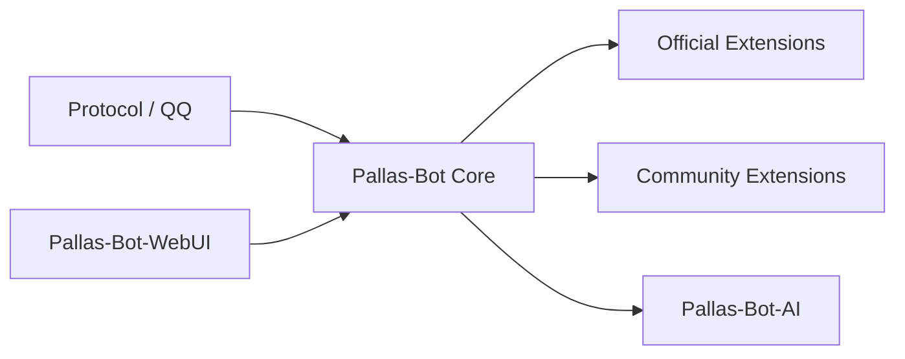

# 架构总览

这页给你一张 Pallas 4.0 当前可执行的架构地图，不论你维护本体、官方扩展还是社区插件。

先记住几个核心判断：

- 主仓负责运行时、平台能力、插件治理、语料底盘与产品语义。
- WebUI 与 AI runtime 是独立仓，但都围绕主仓边界协作。
- 大量玩法能力已经从主仓拆到官方扩展，别再让它们回流成“大而全 core”。

## 总体结构

## 各层分别负责什么

| 层 | 主要职责 |
| --- | --- |
| `Pallas-Bot Core` | 运行时、消息入口、插件加载、权限/冷却/help、WebUI 后端、分片、语料与产品记忆边界 |
| `Pallas-Bot-WebUI` | 前端页面、路由、样式、交互，构建后同步到主仓运行目录 |
| `Pallas-Bot-AI` | 媒体与 AI 任务运行时、provider 编排、队列、健康、callback 基础设施 |
| `Official Extensions` | 官方维护但不适合继续塞进 core 的玩法与外部能力 |
| `Community Extensions` | 社区插件、站点私有插件、第三方能力 |

## 为什么要这样分

4.0 的目标不是删功能，而是把“平台能力”和“玩法能力”拆开。

- 平台能力必须稳定、可治理、可观测。
- 玩法与外部能力可以独立演进、独立发布、独立安装。
- AI 是增强层，不该反向吞掉 Bot 的产品边界。

所以你每加一个能力，都面对一道很实际的判断题：

- 这是所有站点都依赖的平台共性吗？是的话优先考虑 core。
- 这是某类玩法、某个垂直能力、某个外部服务集成吗？优先考虑官方扩展或社区插件。

## 当前稳定边界

下面这些已经是当前事实，不是远期规划：

- `core / official / community` 分层成立。
- WebUI 源码仓与主仓运行产物分离。
- AI callback 回到 Bot 的主链路已经建立。
- 分片模式下，hub / worker / Redis 的职责边界已经明确。
- 插件治理、命令权限、配置热重载都有统一入口，不应该各插件自造轮子。

## 代码视角下的主仓结构

4.0 现行主仓以 `pallas/` 和 `packages/` 为主：

| 路径 | 作用 |
| --- | --- |
| `pallas/` | 内核、平台、功能层、WebUI 后端、配置与运行时基础设施 |
| `packages/` | 内置 core 插件 |
| `tests/` | 内核、平台、插件、分片与回归测试 |
| `docs/` | 架构、维护者文档、开发者文档、插件文档 |

## 开发者最常见的错误边界

### 把 WebUI 产物目录当成前端源码

前端源码在 `Pallas-Bot-WebUI`，主仓 `data/pallas_webui/public/` 只是运行产物。

### 把 AI runtime 当成产品语义层

AI 仓负责运行时，不负责牛格定义权、群味统计权和最终人格解释权。

### 把所有新功能都往 core 塞

如果一个能力本质上是玩法、外部系统接入或可独立安装的增强项，它通常不该直接进 core。

## 建议阅读顺序

1. [Core 与扩展](core-vs-extensions.md)
2. [分片运行时](shard-runtime.md)
3. [Golden Plugin](../plugin-development/golden-plugin.md)
4. [配置存储](config-storage.md)

## 深入阅读

- [Pallas 核心契约](../../architecture/internal/pallas-core-contract.md)
- [内核插件统一化](../../architecture/internal/core-plugin-unification-design.md)
- [AI 终态架构](../../architecture/internal/pallas-final-ai-shape.md)
- [AI 实施与联调](../../architecture/internal/pallas-ai-implementation.md)
