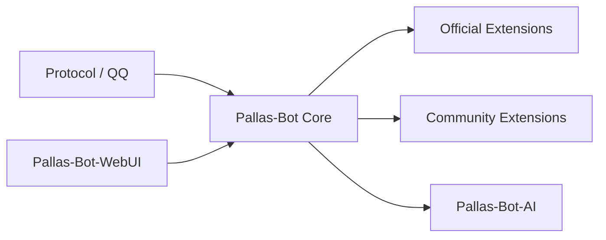

# 架构总览

Pallas-Bot 现行可执行边界：主仓提供运行时与产品语义；WebUI / AI / 官方插件为协作仓；玩法不回流成大一统 core。

## 拓扑

## 层职责

| 层 | 职责 | 代码锚点 |
| --- | --- | --- |
| Core | 运行时、ingress、插件加载、cmd_perm / cooldown / help、WebUI 后端、分片、语料与产品记忆边界 | `pallas/`、`packages/` |
| WebUI | 前端页面与交互；构建后同步到主仓运行目录 | 仓 `Pallas-Bot-WebUI` → `data/pb_webui/public/` |
| AI | 媒体 / LLM 任务 runtime、队列、健康、callback | 仓 `Pallas-Bot-AI` |
| Official Extensions | 官方维护、可独立安装的玩法与外部能力 | 兄弟仓 / PyPI |
| Community Extensions | 第三方与站点私有能力 | Git / 本地 / 索引 |

## 归属判定

| 条件 | 归属 |
| --- | --- |
| 全站点共用的平台基础设施或产品底盘 | Core |
| 可独立发版、按需安装的玩法 / 外部集成 | Official Extension |
| 第三方、实验、站点私有 | Community / `local/plugins/` |

细则：[Core 与扩展](core-vs-extensions.md)。

## 主仓路径

| 路径 | 作用 |
| --- | --- |
| `pallas/` | 内核、平台、产品、console |
| `packages/` | 内置 core 插件（`pb_*` 等） |
| `tests/` | 内核 / 平台 / 插件 / 分片回归 |
| `docs/` | maintainer + developer 主线 |
| `local/plugins/` | 站点私有插件（不入库） |
| `data/` | 运行时数据（不入库） |

## 禁止假设

| 禁止 | 正确做法 |
| --- | --- |
| 把 `data/pb_webui/public/` 当前端源码 | 改 `Pallas-Bot-WebUI` 后同步产物 |
| 把 AI runtime 当产品语义层 | 牛格 / 语料 / 人格边界留在主仓 |
| 新玩法默认进 core | 先按 [Core vs 扩展](core-vs-extensions.md) 判定 |
| 社区插件 import `pallas.core.*` | 只用 `pallas.api.*` |

## 阅读顺序

1. [Core 与扩展](core-vs-extensions.md)
2. [分片运行时](shard-runtime.md)
3. [配置存储](config-storage.md)
4. [插件治理](plugin-governance.md)
5. [Golden Plugin](../plugin-development/golden-plugin.md)

延伸：

- [仓库布局](../reference/repo-layout.md)
- [Platform API](../reference/platform-api.md)
- [Reload 与 Activation](../plugin-development/reload-and-activation.md)
