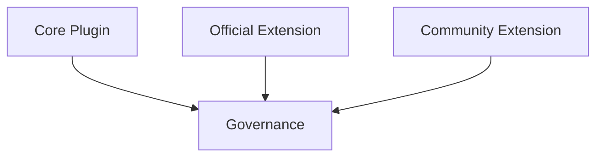

# 插件治理与分层

这页讲 core、官方扩展、社区扩展如何统一进入治理面，以及你写插件时该盯住哪几件事。

## 这张图说明什么

- core、官方扩展、社区扩展都会进入统一治理面
- 治理不是单一页面，而是一组围绕声明、配置、生效方式和可见性的机制
- 平台越统一声明方式，后续 WebUI、CLI 和自动化越容易稳定

## 核心治理面

- `reload_policy`
- `activation_policy`
- 命令权限
- cooldown
- 帮助可见性
- 全局禁用 / 安装 / 更新

## 当前稳定的边界

- `command_permissions` 与 `command_limits` 是现行治理基础
- `reload_policy` 和 `activation_policy` 是两套不同语义
- 插件能力聚合、帮助可见性、全局禁用已经有实际 API 和控制台入口

## 还可能继续演进的实现

- 单插件治理页的展示细节
- 社区插件画像分层
- 更细的安装后自动生效策略

## 你最该关心的三件事

### 1. 插件是否可被治理

如果一个插件没有完整 metadata，它往往就很难进入现行治理页和帮助体系。

### 2. 插件改动后怎样生效

要分清：

- 保存配置后的 reload
- 安装或升级后的 activation

### 3. 插件属于哪一层

core、官方扩展、社区扩展虽然都会被治理，但默认假设和运维方式不完全相同。

## 对应到平台能力

治理相关的核心能力通常包括：

- metadata 声明
- 命令权限覆盖
- 冷却展示与默认值
- 单插件配置接口
- 插件能力聚合接口

## 相关阅读

- [Core 与扩展](core-vs-extensions.md)
- [元数据](../plugin-development/metadata.md)
- [Reload 与 Activation](../plugin-development/reload-and-activation.md)
- [热重载分级](../../architecture/hot-reload-tiers.md)
