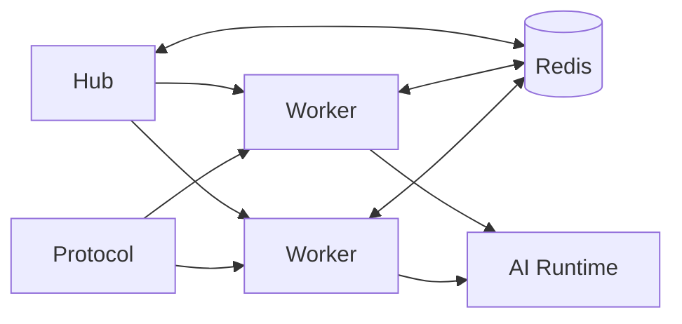

# 分片运行时

这页帮你在写代码时按分片模式思考，而不是教你怎么启动脚本。

记住一点：分片不是把单进程复制多份。hub、worker、Redis、协议端、AI callback 各有职责边界，代码要按这个边界写。

## 运行时结构

## 角色边界

| 角色 | 你该如何理解 |
| --- | --- |
| `hub` | 协调层、控制台聚合层、部分入口层，不是主要消息处理层 |
| `worker` | 插件主要运行位置，绝大多数群消息逻辑都在这里执行 |
| `Redis` | 分片下关键协调事实源，不再只是“可选优化” |
| `Protocol` | 账号侧接入，最终反向连到 worker |

## 对代码设计意味着什么

### 1. 不能假设 hub 能看到所有运行中插件

分片模式里，很多插件实际只运行在 worker。任何只依赖 hub 本地插件加载状态的判断，都可能失真。

### 2. 不能假设本地进程内状态就是全局状态

如果能力跨 worker 生效，就必须考虑：

- Redis 协调
- 共享状态
- 注册表
- worker 聚合回传

### 3. 不能把阻塞式轮询放在 async 热路径里

分片场景下，协调 listener、pubsub、跨 worker 事件循环阻塞，都会很快放大成启动慢、掉连、抖动或大面积超时。

## 分片下开发者最常碰到的三类能力

### ingress 与 claim

同一条消息最终由谁处理，不是简单“每个 worker 都跑一遍 matcher”。Pallas 在分片下依赖统一的 ingress / claim / fanout 策略，避免重复响应。

### hosted activity

像 `duel`、`who_is_spy` 这种“同群同时间只允许一场”的玩法，必须考虑主持牛、活动锁与跨 worker 独占。

### worker 可观测

WebUI 展示的大量状态来自 worker 汇总，不是 hub 本地推断。新增分片相关能力时，要考虑是否需要把状态写入既有 stats / observability 通道。

## 开发新功能时的判断清单

改动涉及下面任一项，就主动按分片思维设计：

- 同群多牛
- 跨 worker 去重
- 需要指定某只牛执行动作
- 群级独占活动
- AI callback 回到发起 worker
- WebUI 需要展示 worker 实时状态

## 分片下的常见错误

### 只在单进程里验证逻辑

单进程能跑，不代表分片下不会重复响应、丢状态或拿错事实源。

### 在 hub 侧直接读取本地插件状态做全局结论

这会遗漏 worker 专属插件和 worker 专属元数据。

### 认为 Redis 只是缓存

::: warning Redis 不是缓存
在当前 4.0 分片设计里，Redis 已经是关键协调层的一部分。别把它当成可丢弃的缓存。
:::

## 推荐阅读顺序

1. [多进程分片架构细节](../../architecture/bot_process_sharding.md)
2. [中央入站调度](../../architecture/internal/central-ingress-dispatch.md)
3. [维护者分片部署](../../maintainer/deploy/sharded.md)

## 相关阅读

- [架构总览](overview.md)
- [Core 与扩展](core-vs-extensions.md)
