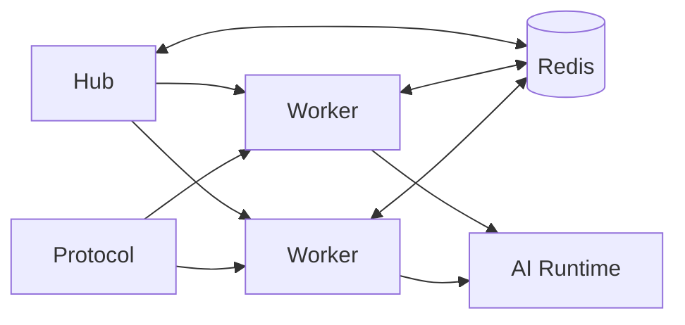

# 分片运行时

分片编码合同。部署脚本见 [maintainer/deploy/sharded](../../maintainer/deploy/sharded.md)。架构细节：[bot_process_sharding](../../architecture/bot_process_sharding.md)、[central-ingress-dispatch](../../architecture/internal/central-ingress-dispatch.md)。

## 拓扑

## 角色

| 角色 | 职责 | 代码锚点 |
| --- | --- | --- |
| Hub | 协调、控制台聚合、部分入口；非主要消息处理 | `is_sharded_hub` / `is_hub_role` |
| Worker | 插件与群消息主路径 | `is_sharded_worker` |
| Redis | 分片协调事实源（非可丢弃缓存） | 分片 coord / presence |
| Protocol | 账号接入，连到 worker | 协议扩展 |

角色探测：`from pallas.api.platform import is_sharded_hub, is_sharded_worker, is_sharding_active`。

## 编码约束

| MUST NOT | MUST |
| --- | --- |
| 假设 hub 本地已加载全部运行中插件 | 需要全局视图时走 worker 聚合 / registry |
| 把进程内状态当集群全局状态 | 跨 worker 用 Redis / 共享注册表 |
| 在 async 热路径做阻塞轮询 | 用既有 listener / pubsub 模式 |

## 高频能力

| 能力 | 合同 | API（`pallas.api.platform`） |
| --- | --- | --- |
| 消息去重 / claim | 同条消息不可多 worker 重复响应 | `try_claim_group_message_once`、`claim_group_message_event`、`claim_group_handler` |
| 群独占活动 | 同群同时一场 | `begin_group_exclusive_activity`、`try_begin_group_owned_gate` |
| Fanout / host gate | ingress 策略与主持牛 | `text_matches_plugin_fanout`、`dream_session_ingress_passes` |
| 跨分片发送 | 指定 bot 代发 | `send_group_message_as_bot`、`invoke_bot_action` |
| Hub-only 启动逻辑 | 勿在 worker 重复挂载 | `startup.py` 内 `is_sharded_worker()` 守卫 |

## 触发分片设计的改动

涉及任一项即按分片设计：

- 同群多牛
- 跨 worker 去重
- 指定某 bot 执行动作
- 群级独占活动
- AI callback 回到发起 worker
- WebUI 展示 worker 实时态

## 禁止

| 禁止 | 原因 |
| --- | --- |
| 仅在单进程验证上述能力 | 分片下会重复响应 / 丢状态 |
| hub 读本地插件态做全局结论 | 遗漏 worker 专属插件 |
| 把 Redis 当可丢弃缓存 | 协调层事实源 |

## 相关

- [架构总览](overview.md)
- [Core 与扩展](core-vs-extensions.md)
- [Platform API](../reference/platform-api.md)
