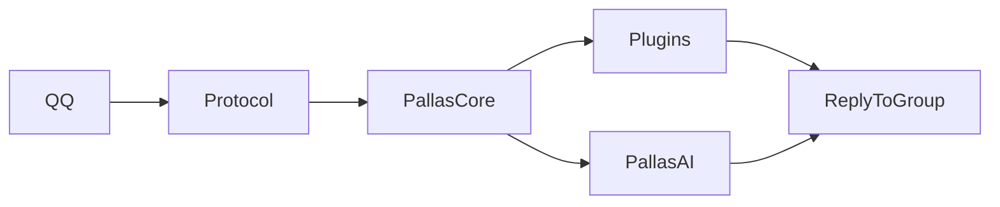
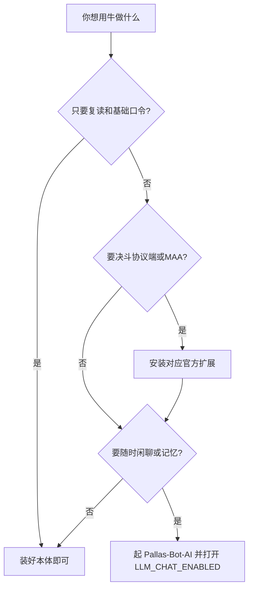

# 把玩法 / AI 也装上

只想五分钟跑通？看 [五分钟跑起来](quickstart.md)。  
这页适合：要装决斗、协议端、MAA，或要随时闲聊 / 记忆。

当前集成在 **`dev-v2`**（尚未全部合入 `main`）。默认只加载 **core**；玩法 / 协议端 / AI 媒体走 **官方扩展**；智能接话依赖 **Pallas-Bot-AI 4.0+**。

::: tip 先别开分片
第一次装：单进程 + 一个 QQ 号就够。先让牛连上 QQ、群里能回话。
:::

## 消息怎么进牛肚子



协议端把 QQ 消息送进来；Core 分给插件或 AI；最后回群。  
牛「没醒」时，多半卡在协议端或 Core，而不是某个玩法插件。

## 一分钟对照

| 你想用 | 最少要做 |
| --- | --- |
| 复读 + 牛格（群风格） | core 即可，`uv run nb run` |
| NapCat 控制台、决斗、MAA… | 装官方扩展（见下文） |
| 随时 @ 闲聊、酒后 LLM、接话 fallback | 起 AI 仓 + 打开 **`LLM_CHAT_ENABLED`**（子项默认已开） |
| 群记忆 / 知识 FAQ | 同上；默认 **hybrid** 检索（需 AI embeddings）；可选放文件到 `data/pallas_knowledge/` |
| 方舟干员资料进 LLM | 同上 + 确保 `data/` 有干员 JSON（决斗扩展或自动 sync） |

拿不准要不要装扩展？



---

## 1. 克隆与依赖

```bash
git clone https://github.com/PallasBot/Pallas-Bot.git
cd Pallas-Bot
git checkout dev-v2
uv sync --dev
```

PostgreSQL：`uv sync --dev --extra pg`  
分片协调 Redis：`uv sync --dev --extra coord-redis`

### 官方扩展（按需）

想一次预装依赖（镜像构建也常用）：

```bash
uv sync --extra deploy-all
```

跑着的站点更推荐控制台插件商店，或按包装：

```bash
uv run pallas ext install pallas-plugin-protocol
uv run pallas ext install pallas-plugin-duel
uv run pallas ext install pallas-plugin-who-is-spy
uv run pallas ext install pallas-plugin-maa
uv run pallas ext install pallas-plugin-ai-media
uv run pallas ext install pallas-plugin-draw
```

常用 extras：

| extra | 包含 |
| --- | --- |
| `plugins-protocol` | NapCat 协议端、重登 |
| `plugins-game` | 决斗 + 谁是卧底 |
| `plugins-maa` | MAA 远控 |
| `plugins-ai-media` | 唱歌 + 酒后 chat |
| `plugins-draw` | 画画 |

随时 @ 闲聊（`llm_chat`）与在线统计（`pb_stats`）是 **core 内置**，不用额外 extra。

::: tip 装完重启
装、卸、升级扩展后重启一次。然后：

```bash
uv run pallas ext list
```

列表里应出现你刚装的包名。
:::

开发联调（不装 pip、直接用仓库内 `src/plugins/`）：

```toml
# config/pallas.toml
[bootstrap]
load_bundled_extra_plugins = true   # 强制始终用仓库内副本
```

生产默认 **`auto`**（可省略）：pip 已装则用 pip，否则用镜像/仓库内副本。长期开发可设 `true`；严格 slim 设 `false`。

---

## 2. 主仓配置

### 2.1 `config/pallas.toml`（最少）

```toml
[bootstrap]
host = "0.0.0.0"
port = 8088
superusers = ["你的QQ号"]
db_backend = "postgresql"

[bootstrap.postgres]
host = "127.0.0.1"
port = 5432
user = "pallas"
password = "pallas"
db = "PallasBot"
```

从 3.x 升级可继续 `db_backend = "mongodb"` + `[bootstrap.mongo]`；迁 PG 见 `tools/migrate_mongo_to_pg.py` 与 [deploy/pg/README.md](../../deploy/pg/README.md)。

### 2.2 环境变量 / WebUI（`webui.json` 优先）

日常在 **`/pallas/` → 通用配置** 保存即可。

#### 智能对话（总闸 + 子项）

| 键 | 4.0 默认 | 说明 |
| --- | --- | --- |
| **`LLM_CHAT_ENABLED`** | **`false`** | **唯一总闸**。`true` 后酒后 LLM、随时 @、接话 LLM 才生效 |
| `AI_SERVER_HOST` | `127.0.0.1` | Pallas-Bot-AI 地址 |
| `AI_SERVER_PORT` | `9099` | AI 仓端口 |
| `LLM_REPEATER_MODE` | `both` | 接话 LLM：`off` / `fallback` / `polish` / `both` |
| `LLM_SESSION_ENABLED` | `true` | 多轮会话（需 PG + Redis 时见 AI 仓） |
| `LLM_GOVERNANCE_ENABLED` | `true` | 闲聊冷却、并发与字数预算 |
| `LLM_TOOLS_ENABLED` | `true` | LLM 可注入方舟等 tool schema（总闸关时无效） |
| `LLM_AFFECT_REFINE_ENABLED` | `true` | 群风格批次情感 refine（总闸关时无效） |

::: tip 减负约定
除 **`LLM_CHAT_ENABLED`** 要你显式打开外，上表子项 **默认全开**；关掉总闸时它们不耗资源。

`LLM_REPEATER_MODE` 怎么理解：

- `off`：只用语料接话
- `fallback`：语料不够时让 AI 补一句
- `polish`：已有候选时让 AI 按牛格轻顺口气
- `both`：两者都开

详见 [`@牛牛`、复读接话与 LLM 的关系](llm-and-repeater.md)。
:::

#### 方舟知识库（结构化查询）

| 键 | 4.0 默认 | 说明 |
| --- | --- | --- |
| `ARKNIGHTS_KB_ENABLED` | `true` | 干员查询 API / LLM tools |
| `ARKNIGHTS_KB_AUTO_SYNC` | `true` | 缺 `resource/arknights/operators_6star.json` 时后台 sync |

数据文件：`resource/arknights/operators_6star.json`（与决斗同源）。手动刷新：

```bash
uv run python scripts/sync_arknights_data.py
# 知识库全量（档案摘录 + 敌人图鉴，不拉头像）
uv run python scripts/sync_arknights_data.py --kb
```

#### 其它相关键

| 键 | 默认 | 说明 |
| --- | --- | --- |
| `group_style_enabled` | `true` | 控制台按 Bot 配置；群风格自动生长 |
| message_scrub | 开启 | 现行默认审查入站；WebUI「消息审查」可调 |

完整键表以 [配置存储](../architecture/settings-storage.md) 与对应插件文档为准。

---

## 3. Pallas-Bot-AI（智能对话运行时）

与主仓 **同级目录** 克隆 [Pallas-Bot-AI](https://github.com/PallasBot/Pallas-Bot-AI)，用与 Bot 匹配的 **4.0** 分支。

```bash
cd ../Pallas-Bot-AI
cp .env.example .env
```

至少配这些：

```env
LLM_CHAT_ENABLED=true
REDIS_URL=redis://127.0.0.1:6379/0
LLM_BACKEND_URL=http://127.0.0.1:11434   # 或远端 OpenAI 兼容 API
LLM_MODEL=qwen2.5:7b
LLM_TOOLS_ENABLED=true                  # 与主仓对齐，默认 true
```

按该仓 README 启动 API（默认 `9099`）与 Celery worker。

主仓启动日志会探测 AI **`api_version` ≥ 4.0.0**；过低会告警。

---

## 4. 启动与验收

```bash
cd Pallas-Bot
uv run nb run
```

| 步骤 | 验收 |
| --- | --- |
| 控制台 | `http://<host>:8088/pallas/` 可登录 |
| 协议端 | 已装 `pallas-plugin-protocol` 时打开协议页并扫码 |
| 帮助 | 群内 **牛牛帮助** 列出已装插件 |
| 连通 | **牛牛连通** 或日志中 AI 探测为 ok |
| LLM | `LLM_CHAT_ENABLED=true` 后试随时 @ / 酒后聊天（需对应扩展） |
| 接话 | 复读正常；`LLM_REPEATER_MODE` 非 `off` 且总闸开时走 fallback/polish |

联调脚本：

```bash
uv run python tools/integration_llm_chat.py --ai-port 9099
uv run python tools/integration_repeater_llm.py --scenario both --ai-port 9099
```

---

## 5. Docker 与分片

| 场景 | `PALLAS_UV_EXTRAS` 示例 |
| --- | --- |
| 仅 core 接话 | `perf,pg` |
| 常用玩法 | `perf,pg,plugins-game,plugins-protocol` |
| 全官方扩展 | `perf,pg,deploy-all` |
| 分片 | 再加 `deploy-shard`，并配置 `REDIS_URL` |

见 [Docker 部署](../DockerDeployment.md)。单机先跑通再考虑分片。

---

## 6. 从 3.x 升级

完整步骤与已知限制见 **[从 3.x 迁到 4.0](4.0-migration.md)**。简要：

1. 备份 `config/pallas.toml`、`data/`、`webui.json`
2. 切 `dev-v2` 或等待 `v4.0.0` tag
3. `uv sync`，再通过插件商店或 `uv run pallas ext install ...` 装所需官方扩展
4. 把 `CHAT_ENABLE` / `OLLAMA_ENABLE` 换成 **`LLM_CHAT_ENABLED`**（对照表见 [ollama → llm_chat](llm-migrate-from-ollama.md)）
5. 确认原内置玩法已装对应扩展包

---

## 7. 已知限制（GA 前）

| 项 | 说明 |
| --- | --- |
| 集成分支 | 功能在 `dev-v2`，合入 `main` 随 GA tag |
| PyPI `pallas-core` | `./scripts/build_core.sh` 可本地构建 wheel；PyPI 正式发布随 GA |
| WebUI i18n | 中文为主（P2） |
| streaming @聊天 | 非流式分段输出（P2） |

OpenAPI codegen、Setup Wizard、商店安装 SSE、日志续传等已在 `dev-v2` 收口，详见 [迁移指南 · 已知限制](4.0-migration.md#3-已知限制40-ga)。

---

## 延伸阅读

| 文档 | 内容 |
| --- | --- |
| [五分钟跑起来](quickstart.md) | 最少跑通 |
| [运维 · LLM 与 AI](../maintainer/operate/llm-and-ai.md) | 闲聊 / 记忆排障 |
| [从 3.x 迁到 4.0](4.0-migration.md) | 升级、dev→main、已知限制 |
| [CHANGELOG](../CHANGELOG.md) | 变更摘要 |
| [Pallas-Bot 核心契约](../architecture/internal/pallas-core-contract.md) | 语料底盘、牛格、群味、多牛社交总纲 |
| [AI 终态架构](../architecture/internal/pallas-final-ai-shape.md) | Bot↔AI 契约 |
| [ollama 迁移](llm-migrate-from-ollama.md) | `CHAT_ENABLE` / `OLLAMA_*` → `LLM_*` |
| [`@牛牛`、复读接话与 LLM 的关系](llm-and-repeater.md) | 两条路径怎么协同 |
| [插件开发入门](../developer/plugin-development/getting-started.md) | 写扩展插件 |
