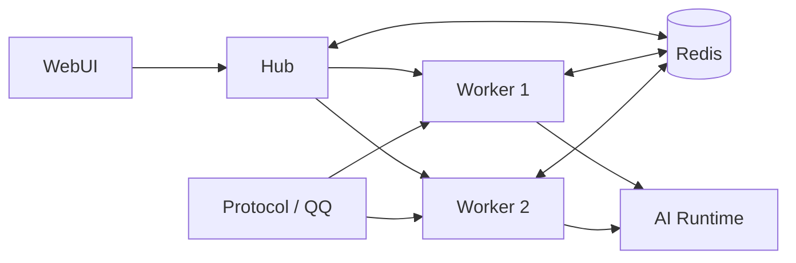

# 分片部署

这页帮你把单进程扩成 hub + worker 分片，并避开最常见的几个坑。

单进程扛不住你的 Bot 数量、协议实例数量或 AI / 游戏类负载时，4.0 的标准扩容方式就是分片。

分片不是“多开几个 Bot 进程”那么简单。它依赖明确的 hub / worker 分工、共享数据目录，以及 Redis 协调路径。

## 什么时候该用分片

适合：

- 多 Bot 账号同时在线
- 多协议实例并行接入
- 单进程下已经卡顿、连接压力大或插件调度抖动
- 想把 WebUI / 协议端 / AI 回调与消息处理角色拆开

不适合：

- 只有 1 到 2 只 Bot
- 还没验证过单进程瓶颈
- 当前环境连共享 `data/` 和 Redis 都不方便提供

## 结构图



## 角色分工

| 角色 | 职责 |
| --- | --- |
| `hub` | WebUI、协议端管理、注册表、部分协调能力、AI callback 入口 |
| `worker` | 真实消息处理、群聊玩法、绝大多数业务插件运行 |
| `Redis` | 跨 worker claim、活动协调、部分广播与状态同步 |
| `Protocol` | QQ 协议接入，最终反向连接到对应 worker |

一个重要原则：协议端最终接到 worker，不是 hub。

## 分片前的硬前提

### 1. 共享 `data/`

hub 与所有 worker 必须用同一份 `data/`。否则这些内容都会错乱：

- `registry.json`
- 协调状态
- 协议端账号映射
- worker presence
- WebUI 聚合状态

### 2. Redis 可用

4.0 分片模式下，关键协调路径依赖 Redis。单进程可以不强制依赖，但分片不行。

推荐在 `config/pallas.toml` 的 `[env]` 里明确配置：

```toml
[env]
REDIS_URL = "redis://127.0.0.1:6379/0"
```

### 3. 端口规划明确

通常约定：

- hub：`8088`
- worker：从 `8090` 起分配

协议端里的 `ws_url` 必须和实际 worker 端口一致。

## 推荐启动方式

::: tip
优先用仓库脚本，别手动拼环境变量起多个进程。
:::

```bash
./scripts/run_sharded_bot.sh start
./scripts/run_sharded_bot.sh status
./scripts/run_sharded_bot.sh stop
```

常见补充用法：

```bash
./scripts/run_sharded_bot.sh start --workers 5
./scripts/run_sharded_bot.sh restart
./scripts/run_sharded_bot.sh test init
./scripts/run_sharded_bot.sh test start
```

这套脚本会处理：

- hub / worker 进程拉起
- 注册表端口对齐
- 协议端 `ws_url` 同步
- 日志目录与 PID 管理

## 该怎么理解分片

### 对外入口

- WebUI 始终主要访问 hub
- AI callback 也先打到 hub
- 协议端账号最终连到 worker

### 对内运行

- worker 才是大多数插件实际运行的地方
- hub 负责聚合 worker 状态并向控制台展示
- 没有 Redis 时，很多跨 worker 能力会直接失效

## 维护者最常做的三个检查

### 检查一：分片是否真的启动完整

看：

- `./scripts/run_sharded_bot.sh status`
- `data/pallas_shard/logs/hub.log`
- `data/pallas_shard/logs/worker-*.log`

别只盯单进程日志，分片问题先看分片日志。

### 检查二：协议端是不是连到了正确 worker

看：

- `data/pallas_shard/registry.json`
- 协议端实例配置里的 `ws_url`
- 当前监听端口是否和注册表一致

### 检查三：WebUI 看到的数据是不是 hub 聚合出来的

分片模式下，控制台很多页面展示的是 hub 聚合后的 worker 状态，而不是 hub 自己的本地状态。看到“插件没加载”“命令 cooldown 不全”“Bot 在线态不对”时，先想想 worker 侧数据有没有正确上报。

## 分片日志与状态文件

优先关注这些路径：

- `data/pallas_shard/logs/hub.log`
- `data/pallas_shard/logs/worker-0.log`
- `data/pallas_shard/logs/worker-1.log`
- `data/pallas_shard/registry.json`
- `data/pallas_shard/stats/worker-*.json`

::: tip
问题只发生在某个 Bot、某个群、某个玩法时，别全局扫所有日志，先收窄到对应 worker。
:::

## 常见故障

### Bot 在线，但消息不处理

优先检查：

- 协议端是否连接到了正确 worker
- worker 日志是否有持续异常
- Redis 是否可达

### WebUI 能打开，但插件状态不对

优先检查：

- hub 是否拿到了 worker 元数据
- 对应插件是否实际运行在 worker，而不是 hub
- `stats/worker-*.json` 与注册表是否正常

### AI 回调到了，但结果没回到群里

优先检查：

- callback 是否先打到 hub
- hub 是否成功转发到目标 worker
- worker 是否仍在线

## 运维建议

- 分片场景默认把 Redis 当成必需依赖，不是可选增强。
- 生产环境用脚本或编排统一管理 hub 与 worker，别只监控 hub。
- 新增 Bot、迁移协议端、调整 worker 数量后，务必重新核对注册表和 `ws_url`。

## 延伸阅读

- [维护者排障](../operate/troubleshooting.md)
- [单进程部署](single-process.md)
- [多进程分片架构细节](../../architecture/bot_process_sharding.md)
- [中央入站调度](../../architecture/internal/central-ingress-dispatch.md)
