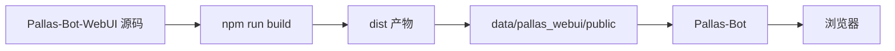

# WebUI

这页帮你部署、更新和排查 WebUI。

4.0 的 WebUI 是“独立前端仓库 + 主仓运行产物”的组合。最容易踩的坑不是页面功能，而是搞错“源码在哪”和“线上实际加载的是哪份资源”。

## 先记住这个边界

- 前端源码仓：`Pallas-Bot-WebUI`
- 主仓运行产物目录：`data/pallas_webui/public/`
- Bot 挂载静态资源时，读的是主仓运行产物，不是源码仓

所以：

- 想改前端页面或样式，得去 `Pallas-Bot-WebUI`。
- 只改主仓 `data/pallas_webui/public/`，下次重新构建同步时会被覆盖。
- 只改源码仓但没重新构建并同步，线上页面不会变。

## 什么时候该看这页

- 你需要部署、更新或排查 WebUI。
- 你发现页面和源码不一致，怀疑资源没有同步。
- 你要判断某个问题属于前端仓、主仓 API，还是静态产物部署问题。

## 运行链路



这条链路任何一步没走完，用户看到的页面都可能不是你以为的那一版。

## 维护者最常见的三类操作

### 1. 正常使用控制台

保证主仓里已经有可用的 `data/pallas_webui/public/`，且 Bot 已正常启动就行。访问入口通常是：

```text
http://<host>:8088/pallas/
```

### 2. 更新 WebUI 资源

拿到新的 `dist.zip` 或新构建产物后：

1. 停止或避开当前写入过程。
2. 把产物解压或覆盖到 `data/pallas_webui/public/`。
3. 重启 Bot 或刷新静态资源缓存。
4. 浏览器里强制刷新，确认版本已变化。

### 3. 修改前端源码并上线

正确流程：

1. 在 `Pallas-Bot-WebUI` 仓库改源码。
2. 执行 `npm run build`。
3. 把生成的 `dist` 同步到主仓 `data/pallas_webui/public/`。
4. 用实际运行中的 Bot 页面验证。

## 如何判断问题出在哪一层

### 页面内容旧了，但后端接口是新的

优先怀疑静态资源没同步，或者浏览器缓存没刷新。

### 前端代码改了，但线上毫无变化

优先检查：

- 改的是不是 `Pallas-Bot-WebUI` 而不是主仓运行目录
- `npm run build` 是否成功
- 构建后的资源是否真的同步到了 `data/pallas_webui/public/`

### API 返回是对的，但 UI 没展示

这通常是前端渲染问题或契约字段不匹配，不是静态资源挂载问题。

### 页面直接 404 或空白

优先检查：

- `data/pallas_webui/public/` 是否存在完整资源
- Bot 是否挂载了 `pb_webui`
- 基础路径是不是 `/pallas/`

## 部署与更新建议

- 把 WebUI 当成一份独立产物管理，别和普通 Python 插件混为一谈。
- 走 Release 包，优先用已经构建好的 `dist.zip`。
- 走源码部署，把“源码修改”和“产物同步”当成两个独立步骤。

## 与主仓 API 的关系

WebUI 前端和后端不在同一个仓库的同一层：

- 前端页面、路由、样式、交互：`Pallas-Bot-WebUI`
- 后端 API、配置落盘、热重载接口：主仓 `pb_webui` 和 `src/console/webui/`

::: tip 怎么快速分流
按钮点了没反应、展示错了、布局炸了，先看前端。
保存失败、返回 500、接口数据不对、配置没落盘，先看主仓后端。
:::

## 维护者排障顺序

1. 确认访问的是正确路径 `/pallas/`。
2. 看 `data/pallas_webui/public/` 是否有完整资源。
3. 强制刷新浏览器缓存。
4. 看 Bot 日志里 `pb_webui` 是否正常挂载。
5. 再判断是前端问题还是 API 问题。

## 延伸阅读

- [维护者排障](../operate/troubleshooting.md)
- [WebUI 后端配置与热重载](../../common/webui/README.md)
- [WebUI 前端开发](../../develop/webui.md)
