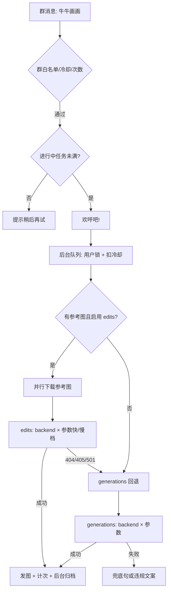

# 🎨 牛牛画画 (Pallas Image)

**牛牛画画** 允许用户在群聊中通过自然语言描述生成图像，或提供参考图进行图生图/修图操作。

## ✨ 功能特性

- **文生图 (Text-to-Image)**：输入提示词，AI 根据描述生成图像。
- **图生图/修图 (Image-to-Image/Edit)**：支持附带参考图或回复图片消息；默认优先走 `/images/edits`，不支持时自动回退 `/images/generations`。
- **多 API 回退**：主配置 `base_url` + `api_key` 失败后，按 `pallas_image_api_backends` 顺序尝试；相同 URL/密钥/模型组合会自动去重。
- **参数快/慢档回退**：上游不支持某组 `size` / `quality` / `response_format` 等时，自动换参数组合；慢档可关闭以缩短失败耗时。
- **多传输层**：`httpx`、`curl-cffi`（TLS 指纹）、系统 `curl`，按配置与连通性自动回退。
- **用量与冷却**：
  - 按群、按用户每日次数上限；白名单群/用户可无限制。
  - 群冷却在**真正开始调用上游**时扣减（已回复「欢呼吧」、进入执行后），排队失败不占冷却。
  - 进程内并发与「进行中任务」上限，避免刷屏拖垮上游。
- **失败回复策略**：额度/鉴权/未分类内部错误对用户显示统一兜底句；违规/审核类错误展示脱敏后的上游文案（去掉 `request id` 等）。
- **原子化存储**：每日次数与可选画图归档写入 `data/pallas_image/`。

## 📋 前置要求

1. **NoneBot2** 环境已搭建。
2. **OneBot v11** 适配器已安装并运行。
3. **兼容 OpenAI Images API 的绘图服务**（如 DALL·E 兼容网关、自建代理等）。
4. （可选）**curl**：传输层选 `curl` 时需系统已安装。

## ⚙️ 配置说明

在 `.env` / `.env.prod` 或 WebUI 插件配置中设置。字段说明以 [`config.py`](../../../src/plugins/pallas_image/config.py) 的 `Field(description=...)` 为准（WebUI 会显示）。

### 基础与 API

| 配置项 | 类型 | 默认值 | 说明 |
| :--- | :--- | :--- | :--- |
| `pallas_image_min_priority` | `int` | `5` | 插件优先级 |
| `pallas_image_base_url` | `str` | `""` | 主 API 根 URL |
| `pallas_image_api_key` | `str` | `""` | 主 API 密钥 |
| `pallas_image_model` | `str` | `gpt-image-2` | 默认模型名 |
| `pallas_image_api_backends` | `JSON 数组` | `[]` | 备选 API，项含 `base_url`、`api_key`，`model` 可选 |
| `pallas_image_request_timeout` | `float` | `180` | 单次 HTTP 生图请求超时（秒） |
| `pallas_image_max_concurrency` | `int` | `2` | 全局同时向上游 POST 的上限 |

**备选 API 示例（环境变量 JSON 一行）：**

```json
[{"base_url":"https://api2.example.com/v1","api_key":"sk-xxx"},{"base_url":"https://api3.example.com/v1","api_key":"sk-yyy","model":"other-model"}]
```

### 生图参数（可全部交给上游默认）

| 配置项 | 类型 | 默认值 | 说明 |
| :--- | :--- | :--- | :--- |
| `pallas_image_size` | `str` | `""` | 如 `1024x1024` |
| `pallas_image_aspect_ratio` | `str` | `""` | 如 `16:9`，与 `size` 二选一 |
| `pallas_image_quality` | `str` | `auto` | 质量档位 |
| `pallas_image_response_format` | `str` | `b64_json` | `b64_json` / `url` 等 |
| `pallas_image_use_edits_for_reference_images` | `bool` | `true` | 有参考图时优先 `/edits` |
| `pallas_image_merge_reference_urls_into_prompt` | `bool` | `false` | 是否把参考图 URL 写入 prompt |
| `pallas_image_default_edit_prompt` | `str` | `按参考图调整` | 仅参考图、无文字时的默认提示 |

### HTTP 传输

| 配置项 | 类型 | 默认值 | 说明 |
| :--- | :--- | :--- | :--- |
| `pallas_image_http_transport` | `str` | `auto` | `auto` / `httpx` / `cffi` / `curl` |
| `pallas_image_tls_impersonate` | `str` | `chrome124` | `cffi` 时 TLS 指纹 |
| `pallas_image_http_user_agent` | `str` | `curl/8.5.0` | 出站 User-Agent |

### 权限与次数

| 配置项 | 类型 | 默认值 | 说明 |
| :--- | :--- | :--- | :--- |
| `pallas_image_draw_group_whitelist` | `list[int]` | `[]` | 非空时仅列出的群可用 |
| `pallas_image_draw_per_user_limit` | `int` | `0` | 每人每群每日上限；`0` 不限 |
| `pallas_image_draw_unlimited_group_ids` | `list[int]` | `[]` | 不受次数限制的群 |
| `pallas_image_draw_unlimited_user_ids` | `list[int]` | `[]` | 不受次数限制的用户 |
| `pallas_image_draw_command_cooldown` | `int` | `3` | 同群两次画画最短间隔（秒）；**开画时**扣减 |

### 重试、超时与稳定性（推荐按需调优）

| 配置项 | 类型 | 默认值 | 说明 |
| :--- | :--- | :--- | :--- |
| `pallas_image_max_param_attempts` | `int` | `6` | 每个 backend 最多尝试的参数组合数（快+慢）；`0` 不限制 |
| `pallas_image_slow_param_fallback` | `bool` | `true` | 快档失败后是否继续慢档（扫常见 size/quality） |
| `pallas_image_draw_total_timeout` | `float` | `480` | 单次画画总耗时上限（含排队、下参考图、重试） |
| `pallas_image_ref_download_timeout` | `float` | `30` | 每张参考图下载超时；实际会受总超时剩余时间压缩 |
| `pallas_image_draw_max_pending` | `int` | `8` | 进程内进行中画画任务上限；`0` 不限制 |

**.env 示例片段：**

```env
PALLAS_IMAGE_BASE_URL=https://your-gateway/v1
PALLAS_IMAGE_API_KEY=sk-...
PALLAS_IMAGE_MODEL=gpt-image-2
PALLAS_IMAGE_MAX_PARAM_ATTEMPTS=6
PALLAS_IMAGE_SLOW_PARAM_FALLBACK=true
PALLAS_IMAGE_DRAW_TOTAL_TIMEOUT=480
PALLAS_IMAGE_DRAW_MAX_PENDING=8
```

## 🎯 优先确保出图（推荐配置取向）

插件默认策略是：**尽量多发图，其次才是少等、少打日志**。实现上包括：

- 主 API → `api_backends` 顺序回退；edits 不行再 generations。
- 每个 backend 内 **快档 + 慢档** 参数扫描（勿轻易关 `slow_param_fallback`）。
- 传输失败时 **先换参数组合，再换 backend**（避免一次超时就放弃整条线路）。
- `auto` 传输下 cffi 读超时且时间仍够时，会用 **httpx 再试一次**（预算约为当次剩余的约 55%，至少 45s）。
- **仅成功发图后**才计每日次数；失败不占额度。

偏「一定要出图」时可适当放宽（按上游实测调整）：

```env
PALLAS_IMAGE_DRAW_TOTAL_TIMEOUT=600
PALLAS_IMAGE_REQUEST_TIMEOUT=240
PALLAS_IMAGE_MAX_PARAM_ATTEMPTS=8
PALLAS_IMAGE_SLOW_PARAM_FALLBACK=true
PALLAS_IMAGE_API_BACKENDS=[{"base_url":"https://备用/v1","api_key":"sk-..."}]
```

上游很慢但稳定时，**不要**把 `draw_total_timeout` 设得比 `request_timeout × 预计尝试次数` 还小，否则会在快出图时被总超时掐掉。

## 🔄 请求流程（简图）



**参数快档（约 2～4 组）**：配置原样 → 换 `response_format` → 去掉 `quality` →（有参考图）去掉请求体 `image` 字段。

**参数慢档**（`pallas_image_slow_param_fallback=true`）：在快档之后追加常见 `quality` / `size` / `aspect_ratio` / 极简体。

**换 backend 不重扫参数**：HTTP `401/403/429/502/503/504`，或 JSON 中额度/鉴权类 `error.code`（如 `insufficient_user_quota`）。

**同 backend 换参数**：HTTP `400/415/422`（参数不兼容）。

## 🚀 使用方法

### 1. 文生图

```text
牛牛画画 一只穿着宇航服的柯基犬，在火星表面，赛博朋克风格
```

### 2. 图生图

- 消息附带图片 + `牛牛画画 …`
- 或回复带图消息后发 `牛牛画画 …`

### 3. 多图参考

一次附带多张图，将综合参考（受上游与 edits/generations 能力限制）。

## 📂 数据存储

`data/pallas_image/`：

| 文件/目录 | 说明 |
| :--- | :--- |
| `pallas_draw_daily_usage.json` | 每人每群每日次数 |
| `draw_archive/`（若启用归档逻辑） | 生成图本地副本（后台写入，不阻塞发图） |

## 🛡️ 错误与日志

| 对用户 | 典型原因 |
| :--- | :--- |
| `呃......咳嗯，下次不能喝、喝这么多了......` | 额度、鉴权、超时、连接失败、未识别上游错误 |
| 上游脱敏文案 | 违规/审核/敏感词等（`content_policy_violation` 等或文案含「违规」「审核」） |
| `牛牛正在给其他小伙伴画画，请稍后再试。` | 超过 `pallas_image_draw_max_pending` |

详细原因请看日志关键字：`pallas_image`、`backend=`、`status=`、`issue=`。内部错误会在 WARNING 中保留完整上游 body。

## 🛠️ 故障排查

1. **连接失败 / `curl_cffi` 读超时 (28)**
   - 检查 `pallas_image_base_url`、网络与防火墙。
   - 网关**不需要** TLS 指纹时，建议 `pallas_image_http_transport=httpx`，或清空 `pallas_image_tls_impersonate`（`auto` 将不再先试 curl_cffi）。
   - `auto` 下 curl_cffi **读超时**且剩余预算 ≥约 50s 时，会用 httpx 再试一次；预算不足则换参数/backend。
   - 日志：`api connect error`、`curl 退出码`、`cffi read timeout, retry httpx`。

2. **一直失败但无图**
   - 核对 `api_key`、`model` 与网关是否支持 `/images/generations`、`/images/edits`。
   - 参考图场景可设 `pallas_image_use_edits_for_reference_images=false` 强制走 generations。
   - 上游不认参数时：减小 `pallas_image_max_param_attempts` 或关闭 `pallas_image_slow_param_fallback` 便于快速定位。
   - 日志：`generations exhausted`、`edits unsupported`、`trying next params`。

3. **太慢 / 占满上游**
   - 降低 `pallas_image_max_concurrency`、`pallas_image_draw_max_pending`。
   - 缩短 `pallas_image_draw_total_timeout` 或关闭慢档。

4. **次数未重置**
   - 按服务器本地自然日；跨天首次调用会清理过期条目。

实现见 [`src/plugins/pallas_image/`](../../../src/plugins/pallas_image/)（`draw.py` 入口、`draw_attempts.py` 重试、`image_api.py` 请求、`image_request_options.py` 参数序列、`config.py` 配置）。
