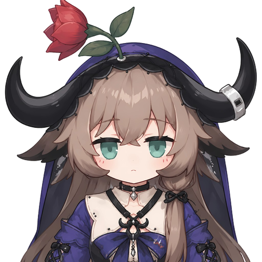

  

<h1 align="center">协议端管理 pb_protocol</h1>

管理 NapCat 和 SnowLuma 协议端实例与连接配置。

  
  
  

## 安装方式

可在控制台插件商店安装，或执行 `uv run pallas ext install pallas-plugin-protocol`。

## 怎么使用

| 入口 / 触发 | 场景 | 说明 |
| --- | --- | --- |
| `/protocol/console/` | 控制台 | 打开协议端管理页。 |
| Web 控制台侧边栏 | 控制台 | 跳转到协议端管理。 |

> 详细用法、限制条件和可用范围以帮助为主。

无群内用户口令。

## 命令权限

无。

## 配置项

> 可在控制台对应插件页中修改。

| 键 | 说明 |
| --- | --- |
| `pallas_protocol_enabled` | 是否加载协议端插件 |
| `pallas_protocol_webui_enabled` | 是否挂载协议端页面 |
| `pallas_protocol_instances_root` | 实例根目录 |
| `pallas_protocol_program_dir` | 协议端程序根目录 |
| `pallas_protocol_docker_onebot_host` | Docker 下写入 OneBot 客户端的主机名或 IP |

## 排障

| 现象 | 处理 |
| --- | --- |
| 账号无法启动 | 检查实例日志、协议端版本和程序目录。 |
| Bot 不回复 | 确认反向 WebSocket 已连到对应 hub 或 worker 端口。 |
| 控制台登录失败 | 口令与主控制台共用；遗忘时查看 FAQ。 |
| Docker 下 WS 连不上 | 检查反向 WS 主机名配置，不要默认写 Compose 服务名。 |

## 实现

源码位置：官方插件扩展仓 `pallas-plugin-protocol`

关键文件：

- 扩展仓 `pb_protocol` 插件入口文件：注册控制台页面、路由和配置。
- 协议端实例管理与日志文件：负责创建实例、启停和日志读取。
- 主仓控制台登录与分片信息：用于共用口令和同步连接目标。

实现要点：

- 这个插件的主要入口是控制台页面，不是群内命令。
- 多机部署时，协议端实例与分片 worker 的路由关系需要保持一致。
- 与 `relogin_bot` 共用同一个官方插件包，但面向场景不同。

## 相关链接

- [重新上号说明](../relogin_bot/README.md)
- [协议端管理插件仓库](https://github.com/TogetsuDo/pallas-plugin-protocol)
